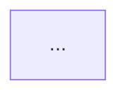
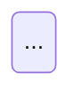
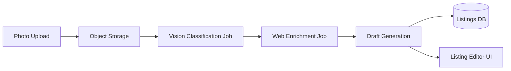
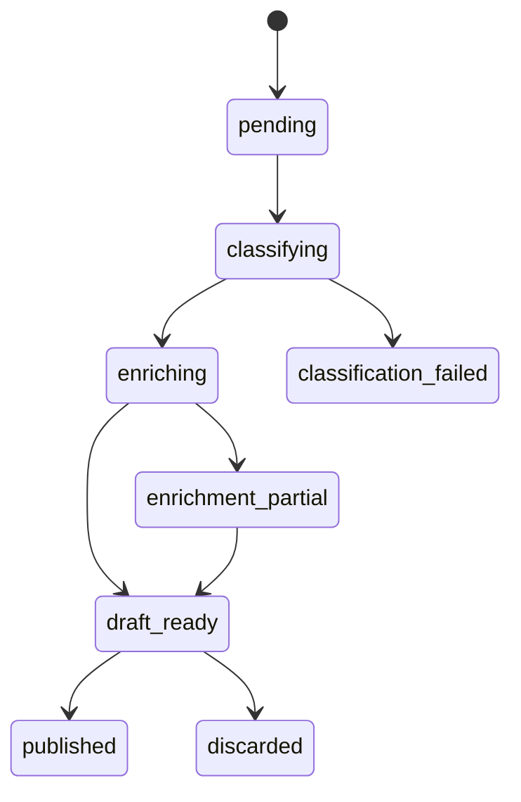

# Stage 2: Engineering review - architecture gate

Post-direction, pre-implementation gate. Takes validated product direction
and returns a buildable technical spec with diagrams. Forces the system to
think through architecture before a single line of implementation code is
written.

Use after the CEO review has locked direction. Still in plan mode.

## The problem this solves

Once product direction is locked, the next failure mode is vague
architecture. "The system will handle it" is not a plan. This stage forces
explicit answers to the hard technical questions before they become
production incidents.

The key unlock is forcing diagram generation. Diagrams surface hidden
assumptions that prose keeps vague. A sequence diagram makes you specify
who calls what. A state machine makes you enumerate every failure mode
explicitly.

## When to use

- After product direction is validated (post ceo-review or equivalent).
- Before any implementation work starts on a non-trivial feature.
- When the feature has async components, external dependencies, or
  multi-step flows.
- Any time "the architecture is clear" needs to be proven, not assumed.

## What it should produce

| Output | Why it matters |
|---|---|
| Architecture diagram (Mermaid) | Makes component boundaries explicit |
| Data flow diagram | Shows where data transforms and who owns what |
| State machine for core flow | Forces enumeration of all states including failures |
| Sync vs async boundary decisions | Prevents "just make it async" without reasoning |
| Failure mode inventory | Every failure path, not just the happy path |
| Trust boundary map | Where do you accept external input? What do you validate? |
| Test matrix | What needs to be tested and at which layer |

## Review template

Do NOT question the product direction. Do NOT suggest scope changes. Do
NOT implement anything. Return a technical spec.

### Step 1: Restate the feature

One or two sentences: what is being built. Confirm you are working from
the correct brief.

### Step 2: Architecture diagram

Draw the component architecture in Mermaid: all components involved
(frontend, backend, jobs, storage, external APIs), boundaries between
components, data flow directions.



### Step 3: Core flow (sequence diagram)

Draw the happy path as a sequence diagram: which components call which,
in what order, what data passes at each step, where async handoffs
happen.

```mermaid
sequenceDiagram
    ...
```

### Step 4: State machine

Draw the state machine for the core domain object: all valid states, all
transitions and their triggers, terminal states (success AND failure).



### Step 5: Sync vs async decisions

For each operation in the flow, decide:

- Synchronous (blocks the request): why, and what is the latency budget?
- Asynchronous (background job): why, what triggers retry, how does the
  caller know it succeeded?

### Step 6: Failure mode inventory

For each step in the flow, enumerate: what can fail, how it fails
(silently? loudly? partial success?), what the recovery path is, what the
user sees. Flag any failure that is currently silent.

### Step 7: Trust boundaries

For each external input (user uploads, API responses, webhook payloads):
what do you trust, what do you validate, where could malicious input
cause harm, is any external data flowing into further processing (prompt
injection risk)?

### Step 8: Test matrix

| Layer | What to test | Why |
|---|---|---|
| Unit | ... | ... |
| Integration | ... | ... |
| E2E | ... | ... |

Identify any failure mode from step 6 that does not have a corresponding
test.

### Step 9: Open questions

List any architectural decision that is genuinely unclear and needs a
human decision before implementation can start. Only blockers, not a
comprehensive list.

## Example

Feature: smart listing creation from photo (post ceo-review). Output
excerpt:



State machine:



Failure modes:

- Classification fails: degrade to manual listing (not silent failure).
- Enrichment partially fails: use what succeeded, flag missing fields.
- Upload succeeds, classification job never starts: orphaned file,
  cleanup job required.
- Web data in draft generation: prompt injection vector, sanitize before
  passing to the model.

## Pipeline position

```text
ceo-review    -> product direction locked
eng-review    -> architecture locked         <- you are here
start         -> produce implementation plan
validate      -> validate before execution
execute       -> execute to merged PR
```
