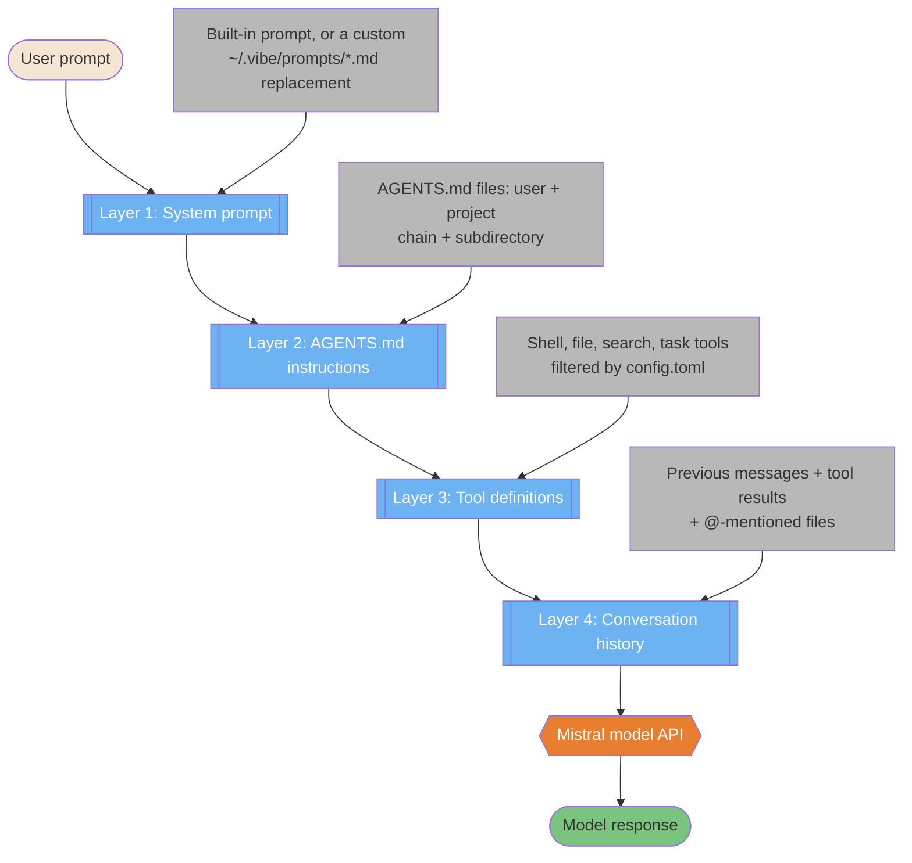
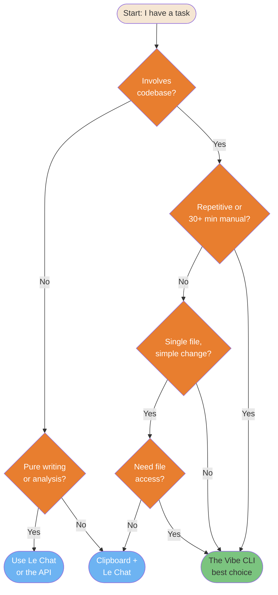

```mermaid
flowchart TD
    subgraph GATE["The tool gate — every profile passes through it"]
        T1["bypass_tool_permissions flag<br/>(auto-approve profile, --yolo)"] --> T4{Configured permission<br/>default: ask}
        T2["Per-call rules: allowlist,<br/>denylist, sensitive patterns"] --> T4
        T3["Session permission store<br/>(approve once / for session)"] --> T4
        T4 -->|always or allowlisted| T5([Auto-approved])
        T4 -->|ask| T6([Approval prompt])
        T4 -->|never or denied| T7([Blocked])
    end

    subgraph ASK["ask — requires approval for tool executions"]
        K1(Tool calls) --> K2([Approval prompt<br/>unless allowlisted])
        K3(Read-only bash commands) --> K4([Auto-approved<br/>safety classification])
    end

    subgraph PLAN["plan — read-only exploration and planning"]
        P1(File reads) --> P2([Auto-approved])
        P3("write_file + edit") --> P4([Blocked<br/>permission: never])
        P5(Plan files under<br/>the VIBE_HOME plans dir) --> P6([Writable])
    end

    subgraph ACCEPT["accept-edits — the default agent"]
        A1("File edits: write_file, edit") --> A2([Auto-approved])
        A3(Shell commands) --> A4([Approval prompt])
        A5(Other tools) --> A4
    end

    subgraph AUTO["auto-approve — or --yolo"]
        U1(All tool calls) --> U2([Auto-approved])
        U3["Use only in:<br/>CI and sandboxed runs"] --> U2
    end

    style T5 fill:#7BC47F,color:#333
    style T6 fill:#E87E2F,color:#fff
    style T7 fill:#E85D5D,color:#fff
    style K2 fill:#E87E2F,color:#fff
    style K4 fill:#7BC47F,color:#333
    style P2 fill:#7BC47F,color:#333
    style P4 fill:#E85D5D,color:#fff
    style P6 fill:#7BC47F,color:#333
    style A2 fill:#7BC47F,color:#333
    style A4 fill:#E87E2F,color:#fff
    style U2 fill:#E85D5D,color:#fff
    style U3 fill:#F5E6D3,color:#333

    click T1 href "../core/tools-reference.md#the-gate-in-order-part-permissions-section-42" "The bypass flag"
    click T2 href "../core/tools-reference.md#file-tools-per-call-resolution-order-part-permissions-section-43" "Per-call rules"
    click T3 href "../core/tools-reference.md#approval-answers-and-persistence-part-permissions-section-42" "Session permission store"
    click T4 href "../core/tools-reference.md#the-gate-in-order-part-permissions-section-42" "Configured permission"
    click T5 href "../core/tools-reference.md#toolsname-keys-part-permissions-section-45-part-config-section-13" "Auto-approved"
    click T6 href "../core/tools-reference.md#permission-behavior--stable" "Approval prompt"
    click T7 href "../core/tools-reference.md#permission-behavior--stable" "Blocked"
    click K1 href "../core/agents-and-skills-reference.md#ask--neutral" "ask — tool calls"
    click K2 href "../core/agents-and-skills-reference.md#ask--neutral" "ask — approval prompt"
    click K3 href "../core/tools-reference.md#shell-tools-per-call-resolution-order-part-permissions-section-44" "ask — read-only bash"
    click K4 href "../core/tools-reference.md#shell-tools-per-call-resolution-order-part-permissions-section-44" "ask — auto-approved"
    click P1 href "../core/agents-and-skills-reference.md#plan--safe" "plan — file reads"
    click P2 href "../core/agents-and-skills-reference.md#plan--safe" "plan — auto-approved"
    click P3 href "../core/agents-and-skills-reference.md#plan--safe" "plan — write tools blocked"
    click P4 href "../core/agents-and-skills-reference.md#plan--safe" "plan — blocked"
    click P5 href "../core/agents-and-skills-reference.md#plan--safe" "plan — plan files"
    click P6 href "../core/agents-and-skills-reference.md#plan--safe" "plan — writable"
    click A1 href "../core/agents-and-skills-reference.md#accept-edits--destructive-the-default-agent" "accept-edits — file edits"
    click A2 href "../core/agents-and-skills-reference.md#accept-edits--destructive-the-default-agent" "accept-edits — auto-approved"
    click A3 href "../core/agents-and-skills-reference.md#accept-edits--destructive-the-default-agent" "accept-edits — shell commands"
    click A4 href "../core/agents-and-skills-reference.md#accept-edits--destructive-the-default-agent" "accept-edits — approval prompt"
    click A5 href "../core/agents-and-skills-reference.md#accept-edits--destructive-the-default-agent" "accept-edits — other tools"
    click U1 href "../core/agents-and-skills-reference.md#auto-approve--yolo" "auto-approve — all tool calls"
    click U2 href "../core/agents-and-skills-reference.md#auto-approve--yolo" "auto-approve — auto-approved"
    click U3 href "../core/agents-and-skills-reference.md#auto-approve--yolo" "CI and sandboxed runs only"
```

# Foundations

> **Verified against vibe 2.25.8 on 2026-09-24.** Documented surface: release 2.25.8.

Core concepts: what the Vibe CLI is and how it fundamentally operates. Every
mechanic in these diagrams is cited against the mechanics oracle as
`(PART-XXX)`.

> **TL;DR.** Four diagrams: how one prompt becomes a four-layer request to the
> model (system prompt, AGENTS.md instructions, tool definitions, conversation
> history); the seven-step turn loop with the tool gate at its decision point;
> a routing decision between the Vibe CLI, Le Chat, and a clipboard workflow;
> and the four agent profiles that set approval posture in place of
> "permission modes" (PART-PERMISSIONS section 4.1).

**Read if** you want the picture behind
[The Core Loop](../learning-path/02-core-loop.md) before reading prose.
**Skip if** you already run the CLI daily; start at
[Architecture](../core/architecture.md) instead.

---

## Prompt Assembly: The Four-Layer Model

The Vibe CLI is a context system, not a chatbot. Your message is assembled into
a multi-layer request before anything reaches the model: a system prompt (the
built-in one, or a custom replacement), the AGENTS.md instruction sections, the
tool definitions filtered by config, and the conversation history
(PART-AGENTSMD; PART-CONFIG section 1.3; PART-SESSIONS section 6.1). The model
API at the end of the chain is Mistral's, selected by `active_model`.



<!-- markdownlint-disable MD033 -->
<details>
<summary>ASCII version</summary>

```text
User prompt
     |
     v
+---------------------------------+
| Layer 1: System prompt          | <- built-in, or ~/.vibe/prompts/*.md
| Layer 2: AGENTS.md instructions | <- user + project + subdirectory files
| Layer 3: Tool definitions       | <- filtered by config.toml
| Layer 4: Conversation history   | <- messages, tool results, @ mentions
+---------------+-----------------+
                |
                v
        Mistral model API
                |
                v
        Model response
```

</details>
<!-- markdownlint-enable MD033 -->

> **Source**: [Architecture — what enters one
> context](../core/architecture.md#what-enters-one-context); the instruction
> layer is per PART-AGENTSMD, tool filtering per PART-CONFIG section 1.3.

---

## The Turn Loop

Every interaction runs the same loop: you prompt, the agent reads, analyzes,
decides, proposes, you review, changes land on disk. The decision point is the
tool gate — bypass flag, then per-call rules, then the configured permission,
which defaults to `ask` (PART-PERMISSIONS section 4.2). When the model's
response contains no pending tool calls, the turn ends and `post_agent` hooks
fire once (PART-HOOKS section 1).

```mermaid
flowchart LR
    A([User prompt]) --> B(Read<br/>read_file + grep)
    B --> C(Analyze<br/>root cause, side effects)
    C --> D{Tool call<br/>needed?}
    D -->|Yes| E(Decide at the tool gate<br/>then execute the call)
    E --> F{More tool<br/>calls?}
    F -->|Yes| G(Feed results<br/>back into context)
    G --> E
    F -->|No| H(Propose<br/>response + diffs)
    H --> I(You review<br/>the change)
    I --> J([Applied to disk])

    style A fill:#F5E6D3,color:#333
    style B fill:#6DB3F2,color:#fff
    style C fill:#6DB3F2,color:#fff
    style D fill:#E87E2F,color:#fff
    style E fill:#E87E2F,color:#fff
    style F fill:#E87E2F,color:#fff
    style G fill:#B8B8B8,color:#333
    style H fill:#6DB3F2,color:#fff
    style I fill:#6DB3F2,color:#fff
    style J fill:#7BC47F,color:#333

    click A href "../learning-path/02-core-loop.md#the-complete-loop-deep-dive" "User prompt"
    click B href "../learning-path/02-core-loop.md#how-the-agent-reads-your-project" "Read"
    click C href "../learning-path/02-core-loop.md#the-complete-loop-deep-dive" "Analyze"
    click D href "../core/tools-reference.md#the-gate-in-order-part-permissions-section-42" "Tool call needed?"
    click E href "../core/architecture.md#2-the-tool-surface" "Decide at the tool gate"
    click F href "../core/architecture.md#1-the-master-loop" "More tool calls?"
    click G href "../core/architecture.md#1-the-master-loop" "Feed results back"
    click H href "../core/architecture.md#1-the-master-loop" "Propose"
    click I href "../learning-path/02-core-loop.md#the-complete-loop-deep-dive" "You review"
    click J href "../learning-path/02-core-loop.md#the-complete-loop-deep-dive" "Applied to disk"
```



<!-- markdownlint-disable MD033 -->
<details>
<summary>ASCII version</summary>

```text
User prompt -> Read -> Analyze -> Tool call needed?
                                          |
                     +--------------------+
                     v
        Decide at the tool gate <----------------+
                     |                             |
                More calls? ---- Yes ---- Feed results back
                     | No
                     v
        Propose -> You review -> Applied to disk
```

</details>
<!-- markdownlint-enable MD033 -->

> **Source**: [The Core Loop](../learning-path/02-core-loop.md#the-complete-loop-deep-dive)
> and [Architecture section 1](../core/architecture.md#1-the-master-loop);
> step names mirror those pages.

---

## Quick Decision Tree: Should I Use the Vibe CLI?

Not every task needs the Vibe CLI. This decision tree routes the right task to
the right surface: the Vibe CLI for codebase work, Le Chat (or the Mistral API)
for pure writing and analysis, and a clipboard workflow for one-off snippets.



<!-- markdownlint-disable MD033 -->
<details>
<summary>ASCII version</summary>

```text
Task involves codebase?
|-- No  -> Pure writing/analysis? -> Yes -> Le Chat or the API
|                                 -> No  -> Clipboard + Le Chat
+-- Yes -> Repetitive or 30+ min?
          |-- Yes -> The Vibe CLI
          +-- No  -> Single file, simple?
                    |-- Yes -> Need file access? -> No  -> Clipboard
                    |                            -> Yes -> The Vibe CLI
                    +-- No  -> The Vibe CLI
```

</details>
<!-- markdownlint-enable MD033 -->

> **Source**: [Choosing Your Adoption Approach](../roles/adoption-approaches.md#decision-tree);
> product names re-labeled (the Vibe CLI, Le Chat).

---

## Agent Modes Comparison

The Vibe CLI has no separate "permission modes". Approval posture is the
selected agent profile: `ask`, `plan`, `accept-edits` (the default
`default_agent`), and `auto-approve`, cycled with Shift+Tab
(PART-PERMISSIONS section 4.1). Every profile passes through the same tool
gate, and shell commands additionally run the bash allow/deny guardrails
(PART-PERMISSIONS sections 4.2-4.4). `--yolo` / `--auto-approve` selects the
`auto-approve` profile, or force-bypasses permissions for a chosen profile
(PART-PERMISSIONS section 4.1).



<!-- markdownlint-disable MD033 -->
<details>
<summary>ASCII version</summary>

```text
The tool gate: bypass flag -> per-call rules -> configured permission
               always/allowlisted -> AUTO     ask -> PROMPT     never -> BLOCKED

ask                       plan (read-only)         accept-edits (default)
----------------------   ----------------------   ----------------------
Tool calls   -> PROMPT    File reads  -> AUTO      File edits -> AUTO
Read-only    -> AUTO      write/edit  -> BLOCKED   Shell cmds  -> PROMPT
bash only                Plan files  -> WRITABLE   Other tools -> PROMPT

auto-approve (--yolo)
----------------------
ALL tool calls -> AUTO     Use: CI and sandboxed runs only
```

</details>
<!-- markdownlint-enable MD033 -->

> **Source**: [Agents and Skills Reference — built-in agent
> profiles](../core/agents-and-skills-reference.md#built-in-agent-profiles--stable);
> rebuilt from PART-PERMISSIONS sections 4.1-4.4.

## Known gaps

- **No `dontAsk` equivalent.** The source guide's fifth mode (auto-deny
  everything unless pre-approved) has no Vibe profile. The closest verified
  behavior: in programmatic mode (`-p`), every approval callback is
  auto-denied (PART-TRUST section 3.4) — anything that would prompt is skipped
  as denied.
- **The source's mode taxonomy was rebuilt, not mapped.** Five permission
  modes became four agent profiles plus the `--yolo` flag; `default` here
  means `default_agent = "accept-edits"`, not a distinct mode
  (PART-PERMISSIONS section 4.1).
- **`smart-approve` is not shown.** Release 2.25.8 adds a `smart-approve`
  agent (classifies each call, auto-runs the safe ones), but it is
  Unified-Harness-only and requires explicitly selecting it
  (PART-AGENTS section 7 deltas) — out of scope for the stable surface.
- **No OS sandbox backs any of this.** The gate is config and trust; there is
  no verified OS-level isolation (PART-TRUST section 3.5).
