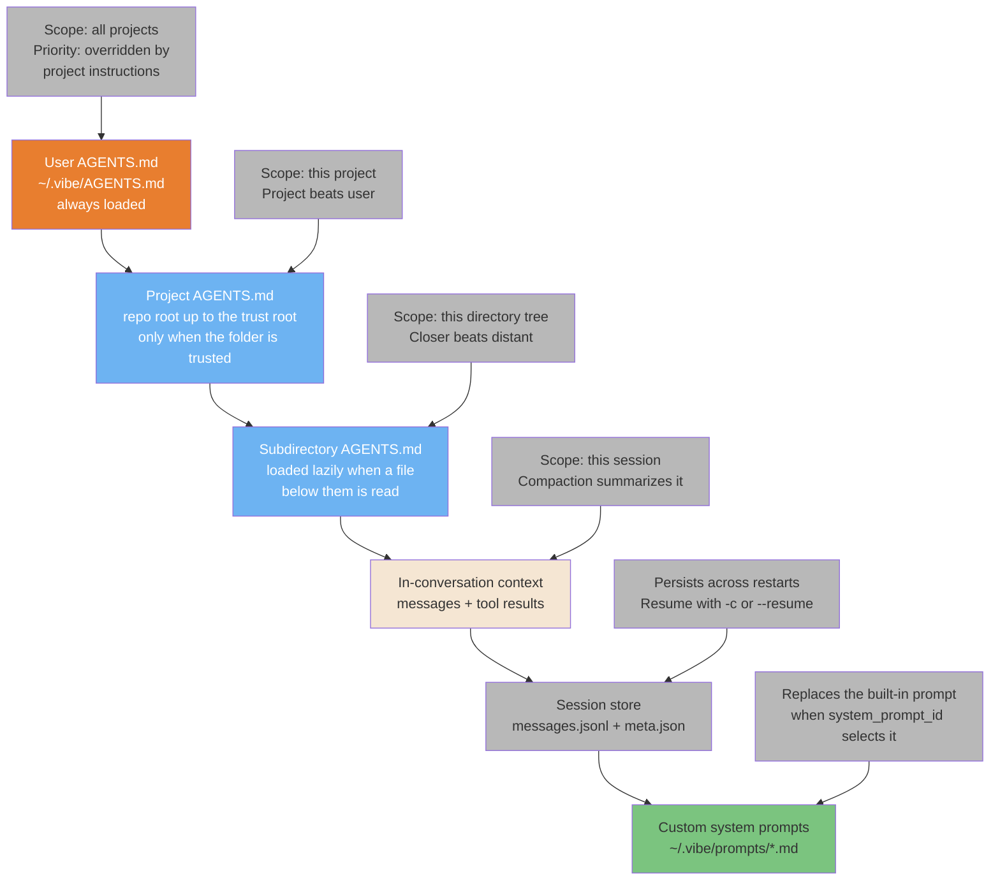

# Context & Sessions

> **Verified against vibe 2.25.8 on 2026-09-24.** Documented surface: release 2.25.8.

How the Vibe CLI manages context, instructions, and sessions across your work.
Every mechanic in these diagrams is cited against the mechanics oracle as
`(PART-XXX)`.

> **TL;DR.** Four diagrams: the compaction model — `auto_compact_threshold`
> defaults to 200,000 tokens, warns once at 50%, fires before a turn at 100%,
> and `0` disables it (PART-SESSIONS section 4.1); the AGENTS.md instruction
> hierarchy — user file always loaded, project chain only when trusted,
> subdirectory files lazily, project beats user and closer beats distant
> (PART-AGENTSMD); session continuity through the session store and resume;
> and the monolith-session anti-pattern versus focused sessions.

**Read if** you want the visual model behind
[Memory Systems](../core/memory-systems.md) and
[Architecture section 3](../core/architecture.md#3-context-management).
**Skip if** you want recipes; [Context Engineering](../core/context-engineering.md)
is the practical deep dive.

---

## The Compaction Model

Context size is governed by one tunable trigger, not a fixed window.
`auto_compact_threshold` defaults to 200,000 tokens and can be overridden per
model; `0` disables auto-compaction entirely. A one-time warning fires at 50%
of the threshold, and the check runs before every turn: when
`context_tokens >= threshold`, the conversation is summarized
(PART-SESSIONS sections 4.1-4.2). `/compact` is the manual valve; `/clear`
starts a new conversation (PART-COMMANDS section 2).

```mermaid
flowchart LR
    subgraph GREEN["Below 50% of the threshold — normal turns"]
        G1("auto_compact_threshold<br/>default: 200,000 tokens")
        G2("Per-model override wins;<br/>0 disables auto-compaction")
        G3("No warning yet — work normally")
    end

    subgraph BLUE["50% of the threshold — one-time warning"]
        B1("Context warning fires<br/>once per session")
        B2("Warning injected<br/>into the prompt")
        B3("No forced action —<br/>keep working")
    end

    subgraph ORANGE["Before the trigger — manual valves"]
        O1("/compact with instructions:<br/>summarize on demand")
        O2("/clear: start a new<br/>conversation")
        O3("compaction_prompt_id and<br/>compaction_model: configurable")
    end

    subgraph RED["At the threshold — auto-compact"]
        R1("Before-turn check:<br/>context_tokens at or over threshold")
        R2("Summary appended; session and<br/>visible conversation unchanged")
        R3("context_tokens reset;<br/>title regenerates")
    end

    GREEN --> BLUE --> ORANGE --> RED

    style G1 fill:#7BC47F,color:#333
    style G2 fill:#7BC47F,color:#333
    style G3 fill:#7BC47F,color:#333
    style B1 fill:#6DB3F2,color:#fff
    style B2 fill:#6DB3F2,color:#fff
    style B3 fill:#6DB3F2,color:#fff
    style O1 fill:#E87E2F,color:#fff
    style O2 fill:#E87E2F,color:#fff
    style O3 fill:#E87E2F,color:#fff
    style R1 fill:#E85D5D,color:#fff
    style R2 fill:#E85D5D,color:#fff
    style R3 fill:#E85D5D,color:#fff

    click G1 href "../core/settings-reference.md#models-and-providers--stable" "The threshold key"
    click G2 href "../core/settings-reference.md#models-and-providers--stable" "Per-model override"
    click G3 href "../core/architecture.md#compaction-a-tunable-trigger-not-a-fixed-window" "Normal turns"
    click B1 href "../core/architecture.md#compaction-a-tunable-trigger-not-a-fixed-window" "One-time warning"
    click B2 href "../core/architecture.md#compaction-a-tunable-trigger-not-a-fixed-window" "Injected warning"
    click B3 href "../core/architecture.md#compaction-a-tunable-trigger-not-a-fixed-window" "Keep working"
    click O1 href "../learning-path/02-core-loop.md#compact--the-manual-valve" "/compact"
    click O2 href "../learning-path/02-core-loop.md#sessions-rewind-resume-and-clear" "/clear"
    click O3 href "../core/settings-reference.md#top-level-scalars--stable" "Compaction prompt and model"
    click R1 href "../core/architecture.md#compaction-a-tunable-trigger-not-a-fixed-window" "The before-turn check"
    click R2 href "../core/architecture.md#compaction-a-tunable-trigger-not-a-fixed-window" "What compaction keeps"
    click R3 href "../core/architecture.md#compaction-a-tunable-trigger-not-a-fixed-window" "Reset and title refresh"
```



<!-- markdownlint-disable MD033 -->
<details>
<summary>ASCII version</summary>

```text
0% ----- 50% of threshold ----- 100% of threshold
|  Green       |  Blue      | Orange |    Red     |
|  normal      |  one-time  | manual |  auto-     |
|  turns       |  warning   | valves |  compact   |
|              |            | /compact| fires     |
|              |            | /clear | before turn|
```

</details>
<!-- markdownlint-enable MD033 -->

> **Source**: [Architecture — compaction](../core/architecture.md#compaction-a-tunable-trigger-not-a-fixed-window);
> rebuilt from PART-SESSIONS sections 4.1-4.2. The source guide's fixed
> 70/90% zone thresholds are not Vibe mechanics and were not kept.

---

## The AGENTS.md Instruction Hierarchy

The Vibe CLI has one instruction file type, `AGENTS.md`, at three scopes: the
user file loads always, the project chain (each open root up to its trust
root) loads only when the folder is trusted, and subdirectory files load
lazily when a file below them is read. Priority: project beats user, and
closer directories beat distant ones (PART-AGENTSMD). Below the instruction
hierarchy sit the conversation itself, the session store that persists it,
and optional custom system prompts that replace the built-in prompt
(PART-AGENTSMD; PART-SESSIONS section 3.1).



<!-- markdownlint-disable MD033 -->
<details>
<summary>ASCII version</summary>

```text
ALWAYS LOADED ----------------------------- RUNTIME ---------------

~/.vibe/AGENTS.md                In-conversation context
      |                                |
<project>/AGENTS.md              Session store (messages.jsonl)
      |                                |
<subdir>/AGENTS.md              Custom system prompts (~/.vibe/prompts/)

Higher = broader instruction scope, injected every turn
Lower = session state, not instructions
Priority inside the chain: project beats user, closer beats distant
```

</details>
<!-- markdownlint-enable MD033 -->

> **Source**: [Memory Systems — the instruction
> hierarchy](../core/memory-systems.md#21-agentsmd-the-instruction-hierarchy);
> per PART-AGENTSMD.

---

## Session Continuity: Save, Resume, Hand Off

Sessions persist under `~/.vibe/logs/session/` as `meta.json` plus
`messages.jsonl`, and resume three ways: `vibe -c` (latest in this folder),
`vibe --resume <ID>` (global, partial IDs supported), and the `/resume` picker
(folder-scoped). Session logging must be enabled for any of them
(PART-SESSIONS sections 3.1-3.3). `/teleport` is a separate, one-way hand-off
to Vibe Code Web — a web surface, not a CLI resume path (PART-WEB section
4.1).

```mermaid
sequenceDiagram
    participant U as You
    participant V as Vibe CLI
    participant S as Session store
    participant W as Vibe Code Web

    U->>V: Work on a feature in this folder
    V->>S: Persist meta.json + messages.jsonl
    Note over V,S: Session logging must be enabled<br/>for any resume (PART-SESSIONS section 3.3)
    U->>V: Exit; open a new terminal
    U->>V: vibe -c / --resume ID / the /resume picker
    V->>S: Load by per-terminal pointer,<br/>folder scope, or globally by ID
    S->>V: Messages, pinned model,<br/>scheduled loops
    V->>U: Context restored; /log prints the log file path

    Note over V,W: /teleport uploads the session to<br/>Vibe Code Web — one-way hand-off,<br/>a web surface (PART-WEB section 4.1)
```

<!-- markdownlint-disable MD033 -->
<details>
<summary>ASCII version</summary>

```text
Session 1                  Session store            Session 2
---------                  ------------            ---------
Work on task                   |                    Open a terminal
     |                         |                        |
     Persist ---------------> meta.json + messages.jsonl
                                                        |
     Load <---------------- per-TTY pointer / folder / ID
     |
Context restored (messages, pinned model, scheduled loops)
```

</details>
<!-- markdownlint-enable MD033 -->

> **Source**: [Architecture — session
> persistence](../core/architecture.md#7-session-persistence); PART-SESSIONS
> sections 3.1-3.5, `/teleport` per PART-WEB section 4.1.

---

## Fresh Context: Anti-Pattern vs. Best Practice

Long sessions accumulate noise that degrades response quality. The fix is
focused sessions with checkpoints: save decisions to AGENTS.md at natural
boundaries, start the next session with `/clear`, and use `/compact` when the
conversation approaches the compaction threshold
(PART-SESSIONS section 4.1; PART-COMMANDS section 2).

```mermaid
flowchart TD
    subgraph BAD["Anti-pattern: the monolith session"]
        B1([Start one giant session]) --> B2(Add task A)
        B2 --> B3(Add task B)
        B3 --> B4(Add task C)
        B4 --> B5{Context keeps growing<br/>across tasks}
        B5 --> B6(Response quality degrades<br/>context rot)
        B6 --> B7(Force-restart<br/>loses all context)
        style B1 fill:#E85D5D,color:#fff
        style B5 fill:#E85D5D,color:#fff
        style B6 fill:#E85D5D,color:#fff
        style B7 fill:#E85D5D,color:#fff
    end

    subgraph GOOD["Best practice: focused sessions"]
        G1([Start a focused session]) --> G2(Complete one task)
        G2 --> G3{Natural<br/>checkpoint?}
        G3 -->|Yes| G4(Save decisions<br/>to AGENTS.md)
        G4 --> G5([/clear and start<br/>the next session])
        G3 -->|No| G6{Approaching the<br/>compaction threshold?}
        G6 -->|Yes| G7(/compact)
        G7 --> G2
        G6 -->|No| G2
        style G1 fill:#7BC47F,color:#333
        style G4 fill:#7BC47F,color:#333
        style G5 fill:#7BC47F,color:#333
        style G3 fill:#E87E2F,color:#fff
        style G6 fill:#E87E2F,color:#fff
        style G7 fill:#6DB3F2,color:#fff
    end

    click B1 href "../core/context-engineering.md#2-the-context-budget" "Anti-pattern: monolith session"
    click B2 href "../core/context-engineering.md#2-the-context-budget" "Add task A"
    click B3 href "../core/context-engineering.md#2-the-context-budget" "Add task B"
    click B4 href "../core/context-engineering.md#2-the-context-budget" "Add task C"
    click B5 href "../core/context-engineering.md#2-the-context-budget" "Context keeps growing"
    click B6 href "../core/context-engineering.md#why-context-rot-is-structural" "Quality degrades"
    click B7 href "../core/context-engineering.md#2-the-context-budget" "Force-restart loses context"
    click G1 href "../core/context-engineering.md#2-the-context-budget" "Best practice: focused sessions"
    click G2 href "../core/context-engineering.md#2-the-context-budget" "Complete one task"
    click G3 href "../core/context-engineering.md#2-the-context-budget" "Natural checkpoint?"
    click G4 href "../core/context-engineering.md#3-the-agentsmd-instruction-hierarchy" "Save to AGENTS.md"
    click G5 href "../learning-path/02-core-loop.md#sessions-rewind-resume-and-clear" "/clear and start the next session"
    click G6 href "../core/architecture.md#compaction-a-tunable-trigger-not-a-fixed-window" "Approaching the threshold?"
    click G7 href "../learning-path/02-core-loop.md#compact--the-manual-valve" "/compact"
```



<!-- markdownlint-disable MD033 -->
<details>
<summary>ASCII version</summary>

```text
BAD: one giant session
Task A -> Task B -> Task C -> growing context -> quality drop -> restart -> lost

GOOD: focused sessions
Task A -> checkpoint? --yes--> save to AGENTS.md -> /clear -> next session
            |
            no
            |
     near the threshold? --yes--> /compact -> continue
            |
            no
            |
        continue the task
```

</details>
<!-- markdownlint-enable MD033 -->

> **Source**: [Context Engineering — the context
> budget](../core/context-engineering.md#2-the-context-budget), re-labeled to
> the verified compaction model.

## Known gaps

- **Fixed context-zone percentages were dropped.** The source guide's
  70/90% "caution/critical" zones are not Vibe mechanics. The verified
  surface is one threshold (200,000 default), a one-time 50% warning, and
  the before-turn trigger (PART-SESSIONS section 4.1); this file reshapes
  the zones around those three facts.
- **No auto-memory tier.** The source guide's sixth memory type (an
  auto-saved `MEMORY.md` per project) has no Vibe equivalent: the verified
  instruction surfaces are the AGENTS.md levels and the session store
  (PART-AGENTSMD; PART-SESSIONS section 3.1). What Vibe does not have is
  cataloged in [Memory Systems](../core/memory-systems.md#23-what-vibe-does-not-have).
- **Teleport is one-way and out of CLI scope.** `/teleport` and
  `/remote-project` are Vibe Code Web surfaces; pulling a session back to
  the local CLI is a planned follow-up, not a verified mechanic
  (PART-WEB section 4.1).
- **The context meter is advisory.** There is no live context-percentage
  meter; the only verified runtime signal is the one-time 50% warning
  (PART-SESSIONS section 4.1).
