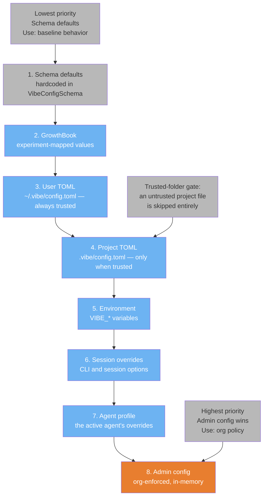
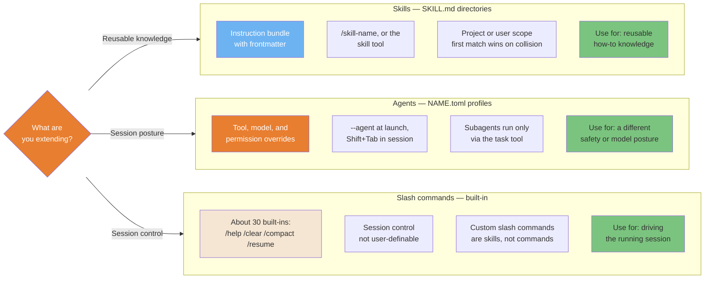

# Configuration System

> **Verified against vibe 2.25.8 on 2026-09-24.** Documented surface: release 2.25.8.

How the Vibe CLI resolves settings, resolves conflicts, and orchestrates
extensibility. Every mechanic in these diagrams is cited against the
mechanics oracle as `(PART-XXX)`.

> **TL;DR.** Four diagrams: config resolves through a verified eight-layer
> stack — defaults, GrowthBook, user TOML, project TOML (trusted folders
> only), `VIBE_*` env vars, session overrides, agent profile, admin config
> (PART-CONFIG section 2.1); extensibility splits into skills (SKILL.md,
> user-invocable), agents (TOML profiles), and built-in slash commands; a
> custom agent goes from TOML discovery to an applied profile layer
> (PART-AGENTS section 8); and hooks run three events — `pre_tool`,
> `post_tool`, `post_agent` — on a stdout JSON decision contract
> (PART-HOOKS sections 1-3, 3.7).

**Read if** you want the picture behind the
[Settings Reference](../core/settings-reference.md). **Skip if** you want a
key-by-key catalog; that page is the reference, this file is the shape.

---

## Config Precedence: The Eight-Layer Stack

Settings resolve through eight layers, lowest to highest. A higher layer
merges over the lower ones key by key: scalars replace, lists concatenate,
tables deep-merge, named entries union by key (PART-CONFIG section 2.1). Two
facts prevent most "why isn't my config working?" bugs: project TOML
overrides user TOML, and an untrusted project file is skipped entirely
(PART-CONFIG section 2.5; PART-TRUST section 3.5).



<details>
<summary>ASCII version</summary>

```text
PRIORITY (lowest to highest)
============================
1. Schema defaults        <- hardcoded fallbacks
2. GrowthBook experiments <- mapped experiment values
3. User ~/.vibe/config.toml
4. Project .vibe/config.toml   (trusted folders only)
5. VIBE_* environment variables
6. Session overrides      <- CLI and session options
7. Agent profile          <- the active agent's overrides
8. Admin config           <- org-enforced, in-memory

Project beats user; an untrusted project file is skipped entirely.
```

</details>

> **Source**: [Settings Reference — the eight-layer
> stack](../core/settings-reference.md#the-eight-layer-stack); PART-CONFIG
> sections 2.1-2.5. The source guide's five-level stack was rebuilt as the
> verified eight layers.

---

## Skills vs. Agents vs. Slash Commands

Three extensibility surfaces with different purposes. Skills are SKILL.md
directories routed by their `description`, invoked as `/skill-name` when
`user-invocable` is true or loaded by the model through the `skill` tool
(PART-SKILLS sections 1.1-1.4). Agents are TOML profiles that change the
session's posture — tools, model, permissions — selected with `--agent` or
Shift+Tab, with `agent_type = "subagent"` profiles spawned through the `task`
tool (PART-AGENTS sections 8-9). Slash commands are the roughly 30 built-ins;
there is no user-definable command file — a custom slash command is a skill
(PART-COMMANDS section 2).



<details>
<summary>ASCII version</summary>

```text
                 Skills                Agents             Slash commands
Location:    .vibe/skills/,        .vibe/agents/,     built-in only
             ~/.vibe/skills/       ~/.vibe/agents/
Trigger:     /skill-name,          --agent,           /command
             the skill tool        Shift+Tab, task
Scope:       project or user       session posture    the running session
Complexity:  medium (a bundle)     high (overrides)  none (fixed set)
Use when:    knowledge to reuse    different tools   session control
                                   or model posture
```

</details>

> **Source**: [Agents and Skills Reference](../core/agents-and-skills-reference.md);
> rebuilt from PART-SKILLS, PART-AGENTS, and PART-COMMANDS.

---

## Custom Agent Lifecycle: Discovery to Invocation

A custom agent is a TOML file: `NAME.toml`, where the agent name is the file
stem. Discovery walks `agent_paths` config entries, then project
`.vibe/agents/` directories (trusted roots and `--add-dir` paths), then
`~/.vibe/agents/`; first match by name wins, and a custom profile whose stem
equals a builtin name overrides the builtin. Every remaining key in the file
becomes an override applied as a dedicated agent-profile config layer
(PART-AGENTS section 8).

```mermaid
sequenceDiagram
    participant C as Vibe CLI startup
    participant M as Agent manager
    participant O as Config orchestrator
    participant L as Agent loop

    C->>M: Discover agent profiles
    Note over M: Search order: agent_paths entries,<br/>project .vibe/agents/ dirs,<br/>then ~/.vibe/agents/ — first match wins
    M->>M: Parse NAME.toml: name = file stem<br/>display_name, description, safety,<br/>agent_type, instructions, overrides
    M->>O: Validate overrides on a throwaway copy
    Note over M,O: A broken profile is dropped<br/>at discovery with a warning
    C->>L: Select: --agent NAME, default_agent,<br/>or the Shift+Tab cycle
    L->>O: Apply the profile (AgentProfileLayer)
    Note over O: Protected fields stripped:<br/>base URL and console keys
    L->>L: Run with the profile's tools,<br/>model, and permissions
    Note over M,L: agent_type = "subagent": never selected<br/>with --agent; spawned only via<br/>the task tool, depth 1
```

<details>
<summary>ASCII version</summary>

```text
Vibe startup
     |
Agent manager: discover agent_paths -> .vibe/agents/ -> ~/.vibe/agents/
     |                (first match by name wins)
Parse NAME.toml  -> name = file stem; rest = overrides
     |
Validate overrides on a throwaway orchestrator copy
     |                (broken profile: dropped with a warning)
Select: --agent NAME / default_agent / Shift+Tab
     |
Apply as AgentProfileLayer (protected fields stripped)
     |
Agent loop runs with the profile's tools, model, permissions

Subagents (agent_type = "subagent"): task tool only, depth 1,
never --agent-selectable.
```

</details>

> **Source**: [Agents and Skills Reference — custom
> agents](../core/agents-and-skills-reference.md#custom-agents--stable);
> PART-AGENTS section 8.

---

## The Hooks Pipeline: pre_tool to post_agent

Hooks are shell commands in `hooks.toml` run at three points: `pre_tool`
before the permission prompt (first deny short-circuits the chain),
`post_tool` only if the tool body actually ran, and `post_agent` once per
finished turn (PART-HOOKS section 1). A hook reads a JSON payload on stdin
and answers on stdout: empty stdout is passthrough, a JSON object carries an
`allow`/`deny` decision. Failure — non-zero exit, timeout, or non-conforming
stdout — is fail-open by default; `strict = true` escalates it
(PART-HOOKS section 3.3). A `post_agent` deny injects the reason as a user
message and the turn retries, at most 3 times per user turn
(PART-HOOKS section 3.7).

```mermaid
flowchart TD
    A([Tool call requested]) --> PRE{pre_tool hooks<br/>matched on tool name}
    PRE -->|deny| D([Call blocked<br/>tool_error to the model])
    PRE -->|allow + tool_input| RW(Rewrite the arguments<br/>re-validated against the schema)
    RW --> GATE
    PRE -->|allow| GATE{The tool gate<br/>permission check}
    GATE -->|allow| C[Tool executes]
    GATE -->|deny or declined| D
    C --> POST{post_tool hooks<br/>only if the body ran}
    POST -->|deny| RP(Replace the tool output text<br/>with the reason)
    POST -->|allow + additional_context| AP(Append context<br/>to the tool output)
    RP --> F{More tool<br/>calls?}
    AP --> F
    F -->|Yes| PRE
    F -->|No| PA{post_agent hooks<br/>once per turn}
    PA -->|deny, under 3| R[Injected user message:<br/>the agent retries the turn]
    R --> PA
    PA -->|deny, 3 of 3| X([Failed:<br/>retries exhausted])
    PA -->|allow| J([Turn complete])

    FAIL["Hook failure: non-zero exit,<br/>timeout, or non-conforming stdout"] -.-> PRE
    OPEN["Fail-open by default: warning, action proceeds.<br/>strict = true: pre_tool denies, post_tool clears output"] -.-> FAIL

    style A fill:#F5E6D3,color:#333
    style PRE fill:#E87E2F,color:#fff
    style GATE fill:#E87E2F,color:#fff
    style D fill:#E85D5D,color:#fff
    style RW fill:#6DB3F2,color:#fff
    style C fill:#7BC47F,color:#333
    style POST fill:#E87E2F,color:#fff
    style RP fill:#6DB3F2,color:#fff
    style AP fill:#6DB3F2,color:#fff
    style F fill:#E87E2F,color:#fff
    style PA fill:#E87E2F,color:#fff
    style R fill:#6DB3F2,color:#fff
    style X fill:#E85D5D,color:#fff
    style J fill:#7BC47F,color:#333
    style FAIL fill:#B8B8B8,color:#333
    style OPEN fill:#B8B8B8,color:#333

    click A href "../core/hooks-events-reference.md#quick-reference--the-three-hookstoml-events-both" "Tool call requested"
    click PRE href "../core/hooks-events-reference.md#quick-reference--the-three-hookstoml-events-both" "pre_tool hooks"
    click D href "../core/hooks-events-reference.md#decision-semantics--the-stdout-contract-both" "Call blocked"
    click RW href "../core/hooks-events-reference.md#decision-semantics--the-stdout-contract-both" "Argument rewrite"
    click GATE href "../core/tools-reference.md#the-gate-in-order-part-permissions-section-42" "The tool gate"
    click C href "../core/tools-reference.md#quick-reference--stable" "Tool executes"
    click POST href "../core/hooks-events-reference.md#quick-reference--the-three-hookstoml-events-both" "post_tool hooks"
    click RP href "../core/hooks-events-reference.md#decision-semantics--the-stdout-contract-both" "Replace output text"
    click AP href "../core/hooks-events-reference.md#decision-semantics--the-stdout-contract-both" "Append context"
    click F href "../core/architecture.md#1-the-master-loop" "More tool calls?"
    click PA href "../core/hooks-events-reference.md#post_agent-deny-retries--max-3-per-user-turn-both" "post_agent hooks"
    click R href "../core/hooks-events-reference.md#post_agent-deny-retries--max-3-per-user-turn-both" "Retry the turn"
    click X href "../core/hooks-events-reference.md#post_agent-deny-retries--max-3-per-user-turn-both" "Retries exhausted"
    click J href "../learning-path/06-hooks.md#post_agent-and-the-retry-loop" "Turn complete"
    click FAIL href "../core/hooks-events-reference.md#fail-open-vs-strict--true-both" "Hook failure"
    click OPEN href "../core/hooks-events-reference.md#fail-open-vs-strict--true-both" "Fail-open vs strict"
```



<details>
<summary>ASCII version</summary>

```text
Tool call requested
     |
pre_tool hooks (matched on tool name)
     |-- deny -----------------------> BLOCKED (tool_error to the model)
     |-- allow + tool_input ----------> arguments rewritten, re-validated
     |-- allow
     v
the tool gate (permission check)
     |-- allow ----> tool executes
     |-- deny -----> BLOCKED
     |
post_tool hooks (only if the body ran)
     |-- deny -------------------> output text replaced with the reason
     |-- allow + context -------> context appended to the output
     |
More tool calls? --yes--> back to pre_tool
     | no
post_agent hooks (once per turn)
     |-- deny (under 3) --> retry user message --> turn retries
     |-- deny (3 of 3) --> FAILED: retries exhausted
     |-- allow -----------> TURN COMPLETE

Any hook failure (non-zero exit, timeout, bad stdout):
fail-open warning by default; strict = true escalates to deny/clear.
```

</details>

> **Source**: [Hooks and Events Reference](../core/hooks-events-reference.md#quick-reference--the-three-hookstoml-events-both);
> PART-HOOKS sections 1-3 and 3.7.

## Known gaps

- **The source's 30-event hook lifecycle was not ported.** Vibe's verified
  CLI hook surface is exactly three events (`pre_tool`, `post_tool`,
  `post_agent`); the source's `PreCompact`, `PostCompact`, `SessionEnd`, and
  similar events have no Vibe equivalents (PART-HOOKS section 1). The six
  typed Unified-Harness hook points are a separate, experimental surface
  (PART-HOOKS-UNIFIED) and are out of scope here.
- **Config is five layers became eight.** The source guide's five-level
  precedence was rebuilt as the verified eight-layer stack; nothing was
  dropped, but no source layer maps one-to-one onto layers 2, 7, or 8
  (PART-CONFIG section 2.1).
- **No user-definable command files.** The source guide's command-directory
  mechanism does not exist in Vibe: custom slash commands are skills, and
  the `/skill-name` resolution only fires when `user-invocable` is true
  (PART-SKILLS section 1.3; PART-COMMANDS section 2 cross-check).
- **Admin config is unverifiable locally.** Layer 8 (org-enforced config) is
  documented in source but cannot be exercised by a single-user install
  (PART-CONFIG section 2.1).
