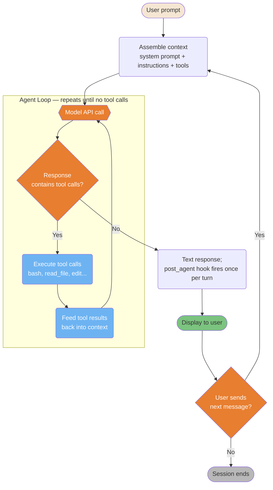

# Architecture Internals

> **Verified against vibe 2.25.8 on 2026-09-24.** Documented surface: release 2.25.8.

What happens between your prompt and the model's answer.

> **TL;DR.** Four diagrams, each rebuilt from the mechanics oracle: the one loop the
> CLI runs and the seams it exposes (compaction check, hook points, budget caps);
> the tool families and the `enabled_tools` / `disabled_tools` controls around them;
> how `AGENTS.md` files assemble into the prompt (project beats user, closer
> directory beats distant); and the `task` tool's depth-1 sub-agent fork, where
> only text returns to the parent.

**Read if** you want the visual model behind
[Architecture](../core/architecture.md) — each diagram is that page's evidence in one
picture. **Skip if** you want recipes; the
[workflows](../workflows/README.md) are the practical entry.

---

## The Agent Loop

The Vibe CLI's core execution is a single loop: send context to the model, execute
the tool calls it returns, feed the results back, repeat until it answers in text.
There is no intent classifier, no router, and no retrieval pipeline in front of it
(PART-CLI; [Architecture section 1](../core/architecture.md#1-the-master-loop)).



<details>
<summary>ASCII version</summary>

```text
User prompt
     |
Assemble context (system prompt + instructions + tools)
     |
 +-- Agent Loop -----------------------------------+
 | Model API call <----------------------------+  |
 |      |                                         |  |
 | Tool calls?                                    |  |
 |  +- Yes -> Execute tool calls ------------------+  |
 |  +- No  -> exit loop                            |
 +-------------------------------------------------+
               |
         Text response; post_agent hook fires once per turn
               |
         Display to user
               |
         User next message? --> Yes -> reassemble context -> loop
               +- No -> Session ends
```

</details>

> **Source**: [Architecture: the master loop](../core/architecture.md#1-the-master-loop)
>
> *Verified seams the diagram encodes: before every turn, a middleware checks
> `context_tokens >= auto_compact_threshold` and can trigger compaction first
> (PART-SESSIONS section 4.1); `pre_tool` hooks run before the permission prompt and
> `post_tool` hooks run if and only if the tool body ran, with `post_agent` once per
> turn (PART-HOOKS section 1); `--max-turns` / `--max-price` / `--max-tokens` cap the
> session in programmatic mode (PART-CLI). Loop internals finer than these seams are
> not documented — see Known gaps.*

---

## Tool Families and Selection

The installed 2.25.7 package ships 26 built-in tool names across eight families, plus
proxy tools that MCP servers and connectors publish at runtime (installed-package
schema dump, vibe 2.25.7; see the
[quick reference](../core/tools-reference.md#quick-reference--stable)). Tool
selection is model-driven — there is no routing table — but the *available set* is
fully controlled: `enabled_tools` (exact names, globs like `bash*`, or `re:` regex)
narrows it, `disabled_tools` subtracts after that, and per-agent profiles can flip
any tool (PART-CONFIG section 1.3; PART-CLI; PART-AGENTS section 8).

```mermaid
flowchart TD
    ROOT["Vibe CLI tool surface"] --> READ
    ROOT --> WRITE
    ROOT --> EXECUTE
    ROOT --> DELEGATE
    ROOT --> WEB
    ROOT --> INTERACT
    ROOT --> EXTEND

    subgraph READ["Read and search tools"]
        R1[read_file<br/>Read a text file, paged]
        R2[grep<br/>Regex search over file contents]
    end

    subgraph WRITE["File write tools"]
        W1[write_file<br/>Create a new file]
        W2[edit<br/>Exact string replacement]
    end

    subgraph EXECUTE["Shell tools"]
        E1[bash / git_bash / powershell<br/>Execute shell commands]
        E2[Managed-shell session tools<br/>flag-gated, 12 names]
    end

    subgraph DELEGATE["Delegation and skills"]
        D1[task<br/>Launch a depth-1 subagent]
        D2[skill<br/>Load a skill by name]
    end

    subgraph WEB["Web tools"]
        WB1[web_fetch<br/>Fetch a URL as markdown]
        WB2[web_search<br/>Search with cited sources]
    end

    subgraph INTERACT["Session and interaction tools"]
        I1[todo<br/>Track the task list]
        I2[ask_user_question<br/>Structured user input]
        I3[exit_plan_mode<br/>Signal the plan is ready]
    end

    subgraph EXTEND["Runtime extensions"]
        X1["{alias}_{tool}<br/>MCP server proxies"]
        X2["connector_{alias}_{tool}<br/>Connector proxies"]
        X3[tool_paths<br/>Custom tools from extra dirs]
    end

    style ROOT fill:#E87E2F,color:#fff
    style R1 fill:#6DB3F2,color:#fff
    style R2 fill:#6DB3F2,color:#fff
    style W1 fill:#F5E6D3,color:#333
    style W2 fill:#F5E6D3,color:#333
    style E1 fill:#E85D5D,color:#fff
    style E2 fill:#E85D5D,color:#fff
    style D1 fill:#E87E2F,color:#fff
    style D2 fill:#E87E2F,color:#fff
    style WB1 fill:#7BC47F,color:#333
    style WB2 fill:#7BC47F,color:#333
    style I1 fill:#B8B8B8,color:#333
    style I2 fill:#B8B8B8,color:#333
    style I3 fill:#B8B8B8,color:#333
    style X1 fill:#B8B8B8,color:#333
    style X2 fill:#B8B8B8,color:#333
    style X3 fill:#B8B8B8,color:#333

    click ROOT href "../core/tools-reference.md#quick-reference--stable" "Vibe CLI tool surface"
    click R1 href "../core/tools-reference.md#file-tools-read_file-write_file-edit" "read_file"
    click R2 href "../core/tools-reference.md#grep" "grep"
    click W1 href "../core/tools-reference.md#file-tools-read_file-write_file-edit" "write_file"
    click W2 href "../core/tools-reference.md#file-tools-read_file-write_file-edit" "edit"
    click E1 href "../core/tools-reference.md#foreground-shell-tools-bash-git_bash-powershell" "Shell tools"
    click E2 href "../core/tools-reference.md#managed-shell-family-background-sessions--stable-flag-experimental-runtime" "Managed-shell family"
    click D1 href "../core/tools-reference.md#task--subagents" "task"
    click D2 href "../core/tools-reference.md#skill" "skill"
    click WB1 href "../core/tools-reference.md#web_fetch-and-web_search" "web_fetch"
    click WB2 href "../core/tools-reference.md#web_fetch-and-web_search" "web_search"
    click I1 href "../core/tools-reference.md#todo" "todo"
    click I2 href "../core/tools-reference.md#ask_user_question" "ask_user_question"
    click I3 href "../core/tools-reference.md#exit_plan_mode" "exit_plan_mode"
    click X1 href "../core/tools-reference.md#mcp-and-connector-tools" "MCP proxy tools"
    click X2 href "../core/tools-reference.md#mcp-and-connector-tools" "Connector proxy tools"
    click X3 href "../core/tools-reference.md#enabling-and-disabling-tools--stable" "tool_paths"
```



<details>
<summary>ASCII version</summary>

```text
READ:     read_file (paged read), grep (content search)
WRITE:    write_file (create), edit (exact replace)
EXECUTE:  bash / git_bash / powershell (ask by default) <- most powerful/risky
          + 12 managed-shell session names (flag-gated)
DELEGATE: task (depth-1 subagent), skill (load a skill)
WEB:      web_fetch, web_search
INTERACT: todo, ask_user_question, exit_plan_mode
EXTEND:   {alias}_{tool} MCP proxies, connector_{alias}_{tool}, tool_paths
```

</details>

> **Source**: [Tools Reference: quick reference](../core/tools-reference.md#quick-reference--stable)
>
> *Simplified: the quick reference is the full inventory. Read-only and interactive
> tools default to `permission = "always"`; mutating tools default to `"ask"`
> (installed-package schema dump, vibe 2.25.7). Every call passes one permission
> gate (PART-PERMISSIONS section 4.2).*

---

## System Prompt Assembly

Before each turn, the CLI assembles the prompt from the default system prompt, your
`AGENTS.md` files, and the tool schemas. The priority rule is stated in the shipped
instruction wrapper: project instructions take priority over user instructions, and
closer directories take priority over more distant ones (PART-AGENTSMD).

```mermaid
sequenceDiagram
    participant V as Vibe CLI
    participant U as User AGENTS.md
    participant P as Project AGENTS.md chain
    participant R as Prompt registry
    participant M as Model API

    V->>R: 1. Resolve system_prompt_id<br/>(default "cli")
    R->>V: Default prompt, or full replacement<br/>from .vibe/prompts/ then ~/.vibe/prompts/
    V->>U: 2. Read ~/.vibe/AGENTS.md<br/>(always loaded)
    U->>V: Injected as "User instructions —<br/>Contents of ~/.vibe/AGENTS.md"
    V->>P: 3. Walk each project root up<br/>to its trust root (trusted only)
    P->>V: Injected as "Project instructions<br/>(checked into the codebase)"
    Note over V: Priority: project over user;<br/>closer directory over distant;<br/>AGENTS.md overrides default behavior
    V->>P: 4. Subdirectory AGENTS.md<br/>loaded lazily when a file below is read
    V->>M: System prompt + instructions<br/>+ user message
```

<details>
<summary>ASCII version</summary>

```text
1. system_prompt_id -> default prompt, or full replacement
   (project .vibe/prompts/ first, then ~/.vibe/prompts/, then builtins)
2. ~/.vibe/AGENTS.md -> always loaded, "User instructions"
3. Project AGENTS.md, each root up to its trust root -> "Project instructions"
   Priority: project > user; closer directory > distant
4. Subdirectory AGENTS.md -> lazily, on read_file of a file below
----------------------------------------------------------------
-> All combined -> model API call
```

</details>

> **Source**: [Architecture: what enters one context](../core/architecture.md#what-enters-one-context)
>
> *Verified: the injected-prompt section titles and the priority semantics are
> source-verified (PART-AGENTSMD); full replacement via `system_prompt_id` resolves
> project prompt dirs first, then `~/.vibe/prompts/`, then builtins (PART-SESSIONS
> section 4.3, same resolution rules as `compaction_prompt_id`). The source guide's
> static/dynamic cache-zone split has no verified Vibe equivalent and was not
> ported.*

---

## Sub-Agent Context Isolation

Sub-agents are completely isolated from the parent: the child receives the task
text only, cannot spawn its own subagents, and only text returns. The isolation is a
security constraint (explicit `ToolError` on recursion) and a design choice (the
parent stays the only coordinator) (PART-AGENTS section 9).

```mermaid
sequenceDiagram
    participant P as Parent session
    participant T as Task tool
    participant S as Child subagent
    participant F as Files and codebase

    Note over P: Full conversation history,<br/>permission store, session dir
    P->>T: task(task="do X", agent="explore")
    Note over T: Creates a child session:<br/>fresh id, is_subagent, parent_session_id,<br/>logged under <parent session dir>/agents/
    T->>S: spawn(task text + scratchpad prefix ONLY)
    Note over S: Does NOT receive:<br/>- Parent conversation<br/>- Parent tool results<br/>- Parent state

    S->>F: grep, read_file, skill<br/>(explore profile: read-only)
    F->>S: Results

    Note over S: Independent reasoning,<br/>depth limit 1 — cannot spawn<br/>another subagent

    S->>T: TaskResult(response, turns_used, completed)
    Note over T: Only text passes back
    T->>P: Result text
    Note over P: Parent summarizes it;<br/>no shared state
```

<details>
<summary>ASCII version</summary>

```text
Parent (full context)
    |
    task(task="...", agent="explore")
    |
    v
Child subagent (ISOLATED)
  Input: task text + scratchpad prefix only
  Inherits: parent permission store, hooks config
  Can: use the profile's enabled tools independently
  Cannot: see parent conversation, spawn subagents (depth limit 1)
  Output: text result ONLY
    |
    v
Parent receives: TaskResult(response, turns_used, completed)
```

</details>

> **Source**: [Architecture: sub-agent architecture](../core/architecture.md#4-sub-agent-architecture)
>
> *Verified: `[tools.task]` defaults to `permission = "ask"` with
> `allowlist = ["explore"]`, so the built-in is auto-approved and custom subagents
> require approval; the child runs without user interaction and its tool set comes
> from the profile, not the mechanism (PART-AGENTS section 9).*

## Known gaps

- **Loop internals beyond the seams.** The oracle documents the turn boundary
  (compaction middleware), the tool-call boundary (`pre_tool`/`post_tool`/
  `post_agent`), and the budget caps — nothing finer. Stop-condition handling, retry
  policy, and event ordering inside a turn are not public
  ([Architecture appendix](../core/architecture.md#appendix-what-we-do-not-know)).
- **No cache-zone model.** The source guide's static/dynamic prompt-cache split with
  a boundary marker was not ported: nothing equivalent is verified for Vibe. The
  token cost of each prompt constituent per turn is also not public.
- **No verified concurrency figure.** The source's "up to 10 concurrent tool
  executions" has no Vibe counterpart; the oracle verifies no parallel-execution
  limit. The diagram intentionally shows execution as a single step.
- **Tool count is a dump, not a per-OS manifest.** 26 names come from the installed
  2.25.7 schema dump; which shell tool ships on which platform is unresolved
  ([Tools Reference gaps](../core/tools-reference.md#known-gaps)).

## See also

- [Architecture](../core/architecture.md) — the prose behind all four diagrams
- [Tools Reference](../core/tools-reference.md) — the full per-tool catalog
- [Agents and Skills Reference](../core/agents-and-skills-reference.md) — the
  `explore` subagent and custom subagent TOML
- [The Core Loop](../learning-path/02-core-loop.md) — the same loop as a learning
  module
