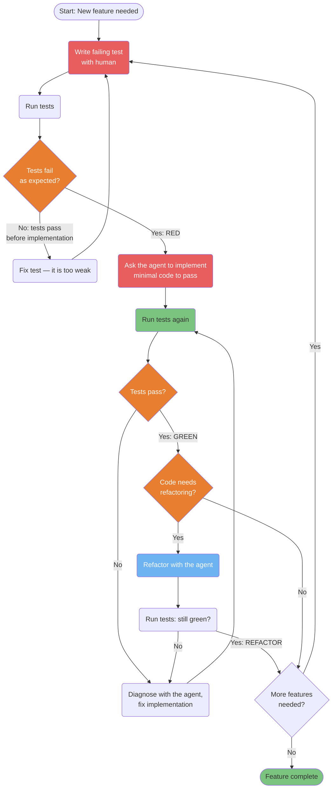
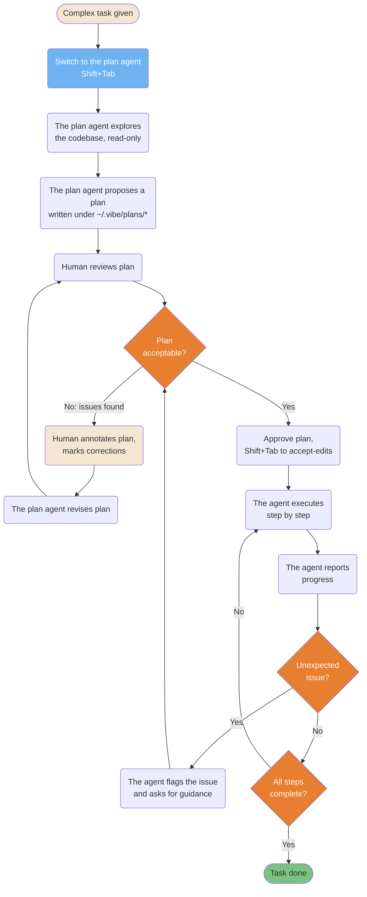
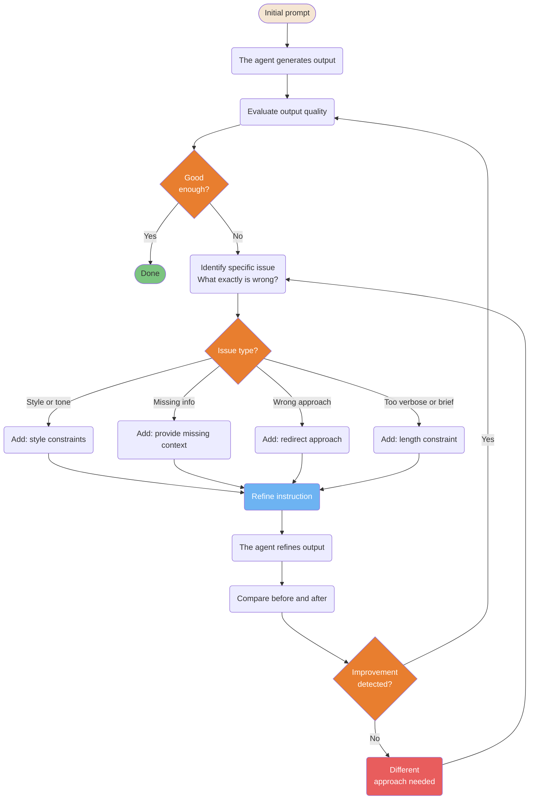
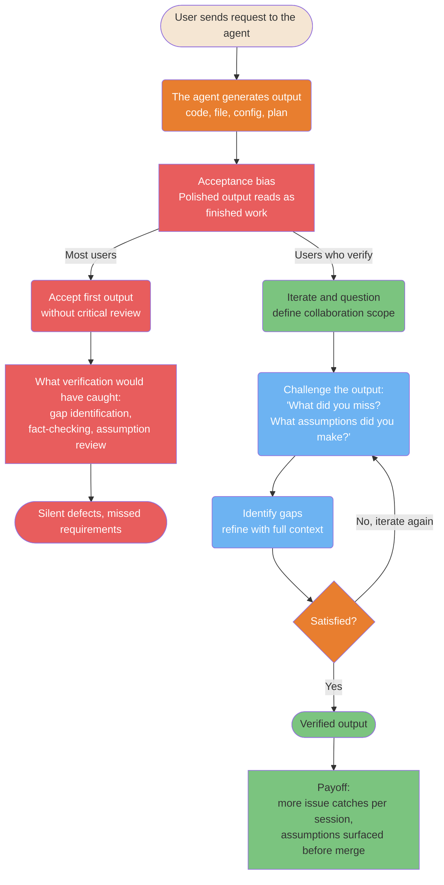

# Development Workflows

> **Verified against vibe 2.25.8 on 2026-09-24.** Documented surface: release 2.25.8.

Proven patterns for structuring agentic development sessions. The methodology is
product-agnostic; where a Vibe mechanic appears (the plan agent, hooks, `/loop`,
programmatic budgets), the prose cites the oracle inline.

> **TL;DR.** Five diagrams: red-green-refactor with the agent prompted explicitly at
> each phase; the intent → spec → tests → implementation pipeline with human gates;
> the plan-then-execute workflow on the read-only plan agent; the targeted-feedback
> refinement loop; and the fork between accepting the first polished output and
> interrogating it. Each links to its full workflow page.

**Read if** you want the one-picture version of a workflow before reading its page.
**Skip if** you already run one of these workflows — the diagrams add no mechanics
beyond the linked pages.

---

## TDD: Red-Green-Refactor with the Agent

Test-driven development adapted for an agentic CLI: write the failing test first,
then ask the agent to implement only what is needed to pass it. Left to its
defaults, an agent writes implementation first — the cycle only happens if you
prompt for it, gate it with a hook, or encode it in `AGENTS.md`
([TDD](../workflows/tdd.md#the-problem)).



<details>
<summary>ASCII version</summary>

```text
Write failing test (RED)
        |
    Run tests
        |
  Fail as expected?
  +- No  -> Fix test (too weak)
  +-- Yes -> Ask the agent: implement minimal code
                |
           Run tests
                |
           Pass? (GREEN)
           +- No  -> Diagnose + fix
           +- Yes -> Refactor?
                    +- Yes -> Refactor (REFACTOR) -> re-run tests
                    +- No  -> Next feature
```

</details>

> **Source**: [TDD with Vibe](../workflows/tdd.md#the-red-green-refactor-cycle)
>
> *Vibe enforcement surface: a `post_tool` hook can run the suite after every file
> edit and append the tail of the output to what the model sees
> (PART-HOOKS section 3.3); an independent headless run (`vibe -p`, budgeted with
> `--max-turns` / `--max-price`) can verify without the authoring context
> (PART-CLI).*

---

## Spec-First Development Pipeline

Write the specification before the code. The agent uses the spec as the single
source of truth, preventing drift between what was planned and what was built. The
document chain is `intent.md` → `spec.md` → `plan.md`, each gated by a human before
the next is written ([Spec-First](../workflows/spec-first.md#the-pattern)).

```mermaid
flowchart LR
    A([Idea / Requirement]) --> A1(Write intent.md<br/>problem + author + constraints)
    A1 --> A2{Intent approved<br/>by PM?}
    A2 -->|No: unclear problem| A1
    A2 -->|Yes| B(Write spec.md<br/>in natural language)
    B --> C(The agent reviews spec<br/>for clarity + completeness)
    C --> D{Spec approved<br/>by human?}
    D -->|No: gaps found| E(Refine spec<br/>address gaps)
    E --> C
    D -->|Yes| F(Generate tests<br/>from spec)
    F --> G(Generate implementation<br/>from spec + tests)
    G --> H(Run test suite)
    H --> I{All tests<br/>pass?}
    I -->|No| J(The agent fixes<br/>implementation)
    J --> H
    I -->|Yes| K(Human review<br/>spec vs output)
    K --> L{Matches<br/>spec?}
    L -->|No| M(Update spec<br/>or implementation)
    M --> K
    L -->|Yes| N(Merge)
    N --> O(Keep the spec current:<br/>scheduled re-checks via /loop)
    O --> P{Requirements<br/>changed?}
    P -->|Yes: update intent and spec| A1
    P -->|No| O

    style A fill:#F5E6D3,color:#333
    style A1 fill:#6DB3F2,color:#fff
    style A2 fill:#E87E2F,color:#fff
    style B fill:#6DB3F2,color:#fff
    style D fill:#E87E2F,color:#fff
    style I fill:#E87E2F,color:#fff
    style L fill:#E87E2F,color:#fff
    style N fill:#7BC47F,color:#333
    style O fill:#F5E6D3,color:#333
    style P fill:#E87E2F,color:#fff

    click A href "../workflows/spec-first.md#the-pattern" "Idea / Requirement"
    click A1 href "../workflows/spec-first.md#the-pattern" "Write intent.md"
    click A2 href "../workflows/spec-first.md#the-pattern" "Intent approved by PM?"
    click B href "../workflows/spec-first.md#step-1-write-the-spec" "Write spec.md"
    click C href "../workflows/spec-first.md#prd-quality-checklist" "Agent reviews spec"
    click D href "../workflows/spec-first.md#step-1-write-the-spec" "Spec approved by human?"
    click E href "../workflows/spec-first.md#prd-quality-checklist" "Refine spec"
    click F href "../workflows/spec-first.md#step-2-reference-the-spec-in-the-prompt" "Generate tests from spec"
    click G href "../workflows/spec-first.md#step-2-reference-the-spec-in-the-prompt" "Generate implementation"
    click H href "../workflows/spec-first.md#step-3-verify-against-the-spec" "Run test suite"
    click I href "../workflows/spec-first.md#step-3-verify-against-the-spec" "All tests pass?"
    click J href "../workflows/spec-first.md#step-3-verify-against-the-spec" "Agent fixes implementation"
    click K href "../workflows/spec-first.md#step-3-verify-against-the-spec" "Human review"
    click L href "../workflows/spec-first.md#step-3-verify-against-the-spec" "Matches spec?"
    click M href "../workflows/spec-first.md#step-4-update-the-spec-if-requirements-change" "Update spec or implementation"
    click N href "../workflows/spec-first.md#step-4-update-the-spec-if-requirements-change" "Merge"
    click O href "../workflows/iterative-refinement.md#scheduled-re-checking-not-condition-loops" "Keep the spec current"
    click P href "../workflows/spec-first.md#step-4-update-the-spec-if-requirements-change" "Requirements changed?"
```



<details>
<summary>ASCII version</summary>

```text
Idea -> Write intent.md -> Approved by PM? -No-> Refine intent
                             | Yes
                       Write spec.md -> Agent reviews
                             |
                       Approved? -No-> Refine spec
                             | Yes
                       Generate tests from spec
                             |
                       Generate implementation
                             |
                       Run tests -> Pass? -No-> Agent fixes
                             | Yes
                       Human review -> Matches spec? -No-> Fix
                             | Yes
                           Merge
                             |
                       Keep the spec current (scheduled /loop re-checks)
                             |
                       Requirements changed? -Yes-> update intent and spec (loop to top)
                             | No
                       keep re-checking
```

</details>

> **Source**: [Spec-First Development](../workflows/spec-first.md#the-pattern)
>
> *The pipeline tail was re-shaped to the verified surface: the source guide closed
> the loop with a production-monitoring stage citing an external playbook; on Vibe,
> the closest verified mechanic is scheduled re-checking with
> `/loop <interval> <prompt>` — idle-fired, minimum 30 s, persisted across resume
> (PART-SESSIONS section 5). `plan.md` can be drafted by the read-only plan agent,
> which persists files only under `~/.vibe/plans/*` (PART-AGENTS section 7).*

---

## Plan-Driven Workflow with Annotation

Complex tasks benefit from separating planning from execution: the read-only plan
agent explores the codebase and writes the plan, you annotate it, then an editing
agent executes only what was approved. This prevents surprises on large refactors.



<details>
<summary>ASCII version</summary>

```text
Complex task
     |
Plan agent (Shift+Tab; write tools never, plans dir allowlisted)
     |
Plan agent explores codebase (read-only)
     |
Plan agent proposes plan (persisted under ~/.vibe/plans/*)
     |
Human reviews --No---> Annotate + plan agent revises ---> re-review
     | Yes
Approve + switch to accept-edits (Shift+Tab)
     |
Agent executes step by step
     |
Unexpected? --Yes---> Flag + ask guidance
     | No
Done? --No---> continue
     | Yes
Complete
```

</details>

> **Source**: [RPI: Phase 2 Plan](../workflows/rpi.md#phase-2-plan)
>
> *Mechanics: the plan agent's write tools are `permission = "never"` with the
> allowlist `~/.vibe/plans/*` (PART-AGENTS section 7); agent switching is Shift+Tab
> cycling in the order ask → plan → accept-edits → auto-approve, applied to the
> running session (PART-AGENTS section 10). The source guide's plan-mode toggle was
> re-labeled to this verified surface.*

---

## Iterative Refinement Loop

Output rarely hits the mark on the first try. This loop gives you a systematic way
to improve results through targeted feedback rather than vague "make it better"
instructions
([Iterative Refinement](../workflows/iterative-refinement.md#1-the-loop)).



<details>
<summary>ASCII version</summary>

```text
Prompt -> Output -> Evaluate -> Good? --Yes--> Done
                                 | No
                          Identify specific issue
                                 |
                          +------+------------------+
                         Style  Missing  Wrong  Length
                          +------+------------------+
                          Refine instruction
                                 |
                          Agent refines
                                 |
                          Better? --Yes--> Evaluate again
                                 | No
                          Different approach
```

</details>

> **Source**: [Iterative Refinement: the loop](../workflows/iterative-refinement.md#1-the-loop)
>
> *Vibe-side surface: `post_tool` and `post_agent` hooks can gate quality between
> iterations (PART-HOOKS sections 1, 3.7), and `/rewind` recovers a previous message
> when an iteration goes sideways (PART-COMMANDS section 2).*

---

## The Polished-Output Fork: Accept or Interrogate

When the agent produces a polished-looking output, a cognitive bias kicks in: the
more complete the output appears, the less critically most users evaluate it. This
guide calls the failure mode prompt-and-pray coding; the fork below is what
separates users who ship silent defects from users who verify
([The Prompt-and-Pray Trap](../roles/learning-with-ai.md#the-prompt-and-pray-trap)).



<details>
<summary>ASCII version</summary>

```text
User request -> Agent output (code, file, config, plan)
                        |
              Acceptance bias: polished output reads as finished
                        |
    +-------------------+----------------------+
Most users                          Users who verify
Accept without review               Iterate + question
        |                                     |
Verification behaviors skipped:    Challenge: "What did you miss?
gap identification, fact-checking,           What assumptions did you make?"
assumption review                            |
        |                          Identify gaps -> refine
Silent defects, missed            Satisfied? --No--> iterate
requirements                                  | Yes
                                  Verified output
```

</details>

> **Source**: [The Prompt-and-Pray Trap](../roles/learning-with-ai.md#the-prompt-and-pray-trap)
>
> *Re-shaped from the source guide's AI-fluency diagram: the source attributed
> specific percentages and multipliers to an external 2026 study; this guide does
> not reproduce those numbers under its evidence discipline (no Vibe mechanic, no
> independently re-verified figures), so the fork keeps the qualitative structure
> only. The verification-side behaviors map to [Best-of-N](../workflows/best-of-n.md#5-verify-outside-the-generation-context)
> verification runs.*

## Known gaps

- **The AI-fluency statistics were dropped, not verified.** The source diagram's
  70/30 split and issue-catching multipliers come from an external study this
  guide's naming policy and evidence discipline keep out; the fork is qualitative.
- **No production-monitoring stage in the spec-first pipeline.** The source closed
  the loop with a production anomaly monitor; the oracle verifies no such surface.
  The re-shaped tail uses `/loop` scheduled re-checks (PART-SESSIONS section 5),
  which fire only while a session is open and idle — they are not a production
  monitor.
- **Plan-mode annotation is a convention, not a mechanic.** Annotating a plan file
  and re-running the plan agent is prompt discipline; the oracle verifies no
  plan-diff or annotation feature.
- **The TDD diagram's timing is yours.** Nothing in the oracle runs the test suite
  automatically; the `post_tool` hook pattern is the only mechanical gate
  (PART-HOOKS section 3.3).

## See also

- [TDD](../workflows/tdd.md), [Spec-First](../workflows/spec-first.md),
  [RPI](../workflows/rpi.md), [Iterative Refinement](../workflows/iterative-refinement.md),
  [Best-of-N](../workflows/best-of-n.md) — the full workflow pages
- [Learning with AI](../roles/learning-with-ai.md) — the prompt-and-pray trap and
  the verification behaviors
- [The Core Loop](../learning-path/02-core-loop.md) — where these cycles run
