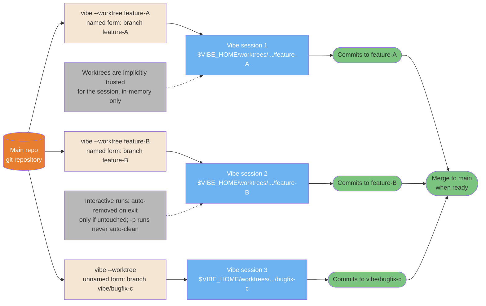
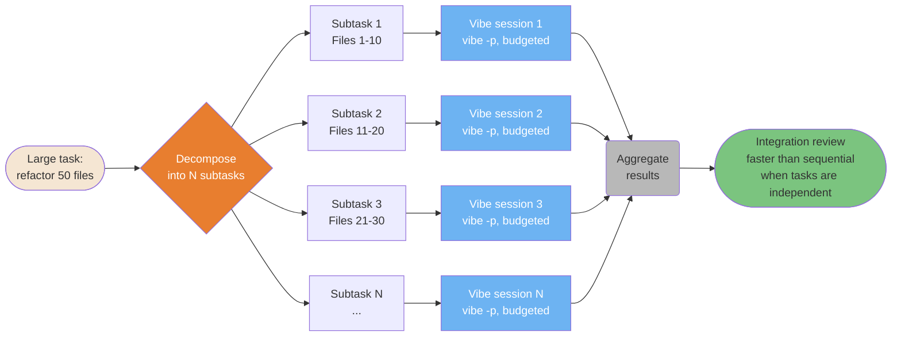
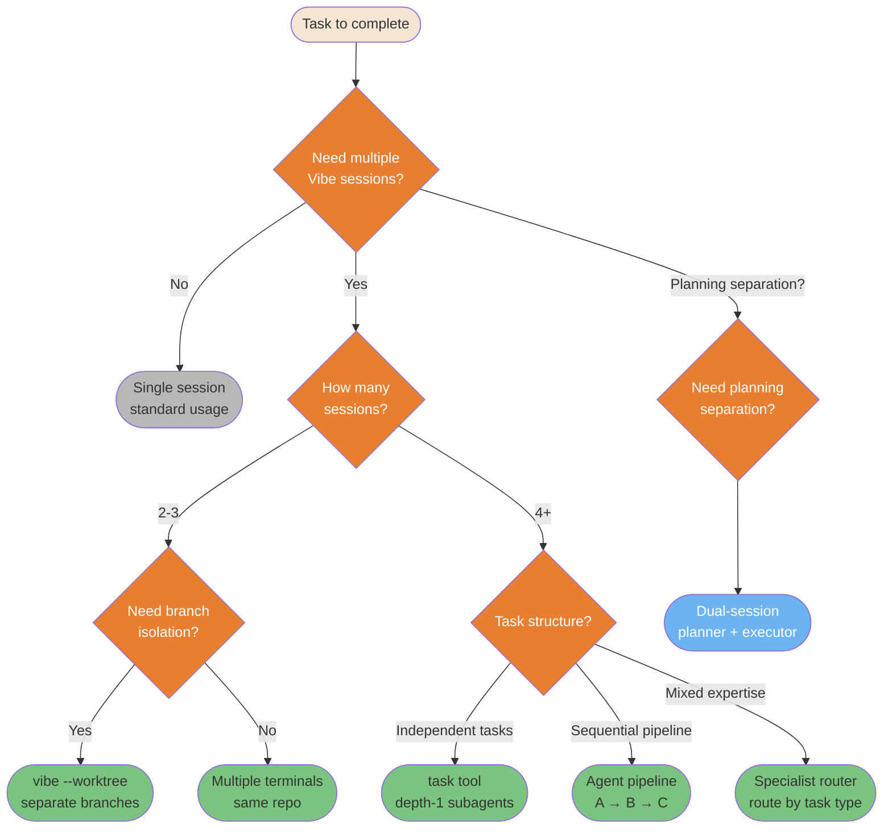

# Multi-Agent Patterns

> **Verified against vibe 2.25.8 on 2026-09-24.** Documented surface: release 2.25.8.

Patterns for coordinating multiple agent sessions for parallel and complex work. The
topologies are product-agnostic; every Vibe mechanic named below cites the oracle.

> **TL;DR.** Five diagrams: the three orchestration topologies and what depth-1
> delegation does to them; `vibe --worktree` multi-instance isolation (branch naming,
> implicit trust, cleanup rules); dual-session planning on the read-only plan agent;
> horizontal scaling with budgeted programmatic runs; and the decision matrix that
> routes a task to the right pattern. Cross-session messaging is not among them —
> the oracle verifies no such surface for the CLI, so that source diagram was
> dropped rather than re-labeled.

**Read if** you are about to fan work out across sessions or subagents and want the
topology decision in one picture. **Skip if** you run one session at a time —
[Agents and Skills Reference](../core/agents-and-skills-reference.md#the-task-tool--stable)
is the whole story for you.

---

## Orchestration: 3 Topologies

Three proven topologies for multi-agent coordination. Choose based on task
independence, ordering requirements, and specialization needs
([Orchestration Patterns](../learning-path/07-advanced.md#orchestration-patterns)).

```mermaid
flowchart TD
    subgraph ORCH["Pattern 1: Orchestrator + Workers"]
        OL[Lead Orchestrator] --> OW1[Worker 1<br/>Frontend]
        OL --> OW2[Worker 2<br/>Backend]
        OL --> OW3[Worker 3<br/>Tests]
        OW1 & OW2 & OW3 --> OR([Results aggregated])
    end

    subgraph PIPE["Pattern 2: Pipeline"]
        PA[Agent A<br/>Requirements] --> PB[Agent B<br/>Implementation]
        PB --> PC[Agent C<br/>Review]
        PC --> PD([Final output])
    end

    subgraph ROUTE["Pattern 3: Specialist Router"]
        RR{Router Agent<br/>analyzes task} --> RC[Code Agent]
        RR --> RT[Test Agent]
        RR --> RD[Docs Agent]
        RC & RT & RD --> RO([Specialized result])
    end

    style OL fill:#E87E2F,color:#fff
    style OW1 fill:#6DB3F2,color:#fff
    style OW2 fill:#6DB3F2,color:#fff
    style OW3 fill:#6DB3F2,color:#fff
    style OR fill:#7BC47F,color:#333
    style PA fill:#F5E6D3,color:#333
    style PB fill:#F5E6D3,color:#333
    style PC fill:#F5E6D3,color:#333
    style PD fill:#7BC47F,color:#333
    style RR fill:#E87E2F,color:#fff
    style RC fill:#6DB3F2,color:#fff
    style RT fill:#6DB3F2,color:#fff
    style RD fill:#6DB3F2,color:#fff
    style RO fill:#7BC47F,color:#333

    click OL href "../learning-path/07-advanced.md#pattern-2-parallel-fork-join" "Lead Orchestrator"
    click OW1 href "../learning-path/07-advanced.md#pattern-2-parallel-fork-join" "Worker: Frontend"
    click OW2 href "../learning-path/07-advanced.md#pattern-2-parallel-fork-join" "Worker: Backend"
    click OW3 href "../learning-path/07-advanced.md#pattern-2-parallel-fork-join" "Worker: Tests"
    click OR href "../learning-path/07-advanced.md#pattern-2-parallel-fork-join" "Results aggregated"
    click PA href "../learning-path/07-advanced.md#pattern-1-sequential-pipeline" "Agent A: Requirements"
    click PB href "../learning-path/07-advanced.md#pattern-1-sequential-pipeline" "Agent B: Implementation"
    click PC href "../learning-path/07-advanced.md#pattern-1-sequential-pipeline" "Agent C: Review"
    click PD href "../learning-path/07-advanced.md#pattern-1-sequential-pipeline" "Final output"
    click RR href "../learning-path/07-advanced.md#pattern-3-conditional-if-then" "Router Agent"
    click RC href "../learning-path/07-advanced.md#pattern-3-conditional-if-then" "Code Agent"
    click RT href "../learning-path/07-advanced.md#pattern-3-conditional-if-then" "Test Agent"
    click RD href "../learning-path/07-advanced.md#pattern-3-conditional-if-then" "Docs Agent"
    click RO href "../learning-path/07-advanced.md#pattern-3-conditional-if-then" "Specialized result"
```



<details>
<summary>ASCII version</summary>

```text
ORCHESTRATOR + WORKERS:      PIPELINE:               ROUTER:

   Lead Agent                Agent A (requirements)   Router
  /    |     \                    |                  /  |  \
W1    W2     W3              Agent B (implement)   Code Test Docs
  \   |     /                    |                  \  |  /
   Aggregate                Agent C (review)        Result
                                 |
                             Final output
```

</details>

> **Source**: [Orchestration Patterns](../learning-path/07-advanced.md#orchestration-patterns)
>
> *The Vibe constraint on all three: within one session, coordination is
> hub-and-spoke. The `task` tool forks depth-1 subagents that cannot see each other
> or the parent's context, so "Lead Orchestrator" is the parent session, workers are
> subagents, and results chain through the parent's context only
> (PART-AGENTS section 9; [Architecture](../core/architecture.md#depth-1-means-hub-and-spoke-explicitly)).
> Topologies that need peers to talk directly require separate sessions, not
> subagents.*

---

## Worktree Multi-Instance Pattern

Worktrees enable true parallel development: each Vibe session works in an isolated
branch with its own working tree. No conflicts, no context mixing
(PART-WORKTREES).



<details>
<summary>ASCII version</summary>

```text
Main repo
|- vibe --worktree feature-A -> session 1 -> commits to branch feature-A
|- vibe --worktree feature-B -> session 2 -> commits to branch feature-B
`- vibe --worktree (unnamed) -> session 3 -> commits to branch vibe/bugfix-c

Named form: worktree and branch both named NAME; reused only for the same
repo on that branch. Unnamed form: worktree named after the prompt (max 40
chars), branch always vibe/<name>, never reused.
No conflicts: separate working trees, separate branches.
All merge back to main when done.
```

</details>

> **Source**: [Isolation: Run Releases in a Worktree](../learning-path/07-advanced.md#isolation-run-releases-in-a-worktree)
>
> *Verified mechanics the diagram encodes (PART-WORKTREES): worktrees live under
> `$VIBE_HOME/worktrees/<repo-name>-<repo-hash>/NAME`; the named form's branch is
> `NAME`, the unnamed form's is always `vibe/<name>`; `vibe --worktree "text"`
> treats the string as the NAME — put the prompt first or use `--`; sessions in a
> worktree are directory-scoped for `-c`, so carry a session across worktrees with
> `--resume <ID>`.*

---

## Dual-Session Planning Pattern

Separating planning from execution across two sessions prevents costly mistakes:
the planner is the read-only plan agent, so it cannot modify the codebase during
analysis, and the plan persists under `~/.vibe/plans/*` for the executor to follow.

```mermaid
sequenceDiagram
    participant U as User
    participant PL as Planner session<br/>(plan agent, read-only)
    participant EX as Executor session<br/>(accept-edits or --auto-approve)

    U->>PL: "Plan how to refactor the auth module"
    Note over PL: Reads the codebase, analyzes requirements<br/>No execution risk: write tools "never"<br/>except ~/.vibe/plans/*

    PL->>U: Detailed plan:<br/>1. Files to change<br/>2. Order of operations<br/>3. Risk points<br/>4. Rollback strategy

    U->>U: Review plan carefully
    Note over U: Human checkpoint:<br/>approve or adjust

    U->>EX: "Execute this plan: [plan text]"
    EX->>EX: Implements step by step
    EX->>U: Progress updates + results

    Note over PL,EX: Key insight: the planner can be<br/>more thorough without execution risk;<br/>the executor inherits the plan as text
```

<details>
<summary>ASCII version</summary>

```text
User -> Planner (plan agent, read-only): "Plan X"
         |
    [safe analysis, write tools never except the plans dir]
         |
Planner -> User: detailed plan (persisted under ~/.vibe/plans/*)
         |
User reviews + approves
         |
User -> Executor (accept-edits / --auto-approve): "Execute: [plan]"
         |
    [implements with the plan as its contract]
         |
Executor -> User: results
```

</details>

> **Source**: [Planning with the plan agent](../workflows/tdd.md#planning-with-the-plan-agent)
>
> *Verified (PART-AGENTS section 7): the plan agent's `write_file`/`edit` are
> `permission = "never"` with the allowlist `~/.vibe/plans/*`, and it is read-only
> otherwise. The source guide's "planner with no tools" was re-labeled precisely:
> the plan agent keeps read and (gated) shell tools — the guarantee is about writes,
> not toollessness. For unattended execution, `--auto-approve` / `--yolo` allows all
> tool calls (PART-CLI).*

---

## Horizontal Scaling Pattern

When tasks can be parallelized, spawn N sessions simultaneously instead of running
them sequentially. The speedup is proportional to task independence — the multiplier
itself is a practitioner anecdote, not a verified figure.



<details>
<summary>ASCII version</summary>

```text
Large task
     |
Decompose into N independent subtasks
     |
+----+----+
|    |    |
I1  I2  I3... (parallel, each a budgeted vibe -p run)
|    |    |
+----+----+
     |
Aggregate -> Integration review
(faster than sequential when subtasks are truly independent)
```

</details>

> **Source**: [Pattern 2: Parallel (Fork-Join)](../learning-path/07-advanced.md#pattern-2-parallel-fork-join)
>
> *Verified surface for each parallel lane (PART-CLI): `vibe -p [TEXT]` runs
> headless with `--max-turns N`, `--max-price DOLLARS`, `--max-tokens N` budgets;
> approval-required calls are auto-DENIED headless, so allowlist what the lanes need
> or pass `--auto-approve`. The source's "~10x faster" claim was not ported as fact —
> no benchmark is verified.*

---

## Multi-Session Decision Matrix

Not every task needs multiple sessions. This decision tree routes a task to the
right pattern based on its characteristics.



<details>
<summary>ASCII version</summary>

```text
Need multiple sessions?
|- No -> Single session
|- Yes -> How many?
|        |- 2-3 -> Need branch isolation?
|        |        |- Yes -> vibe --worktree (separate branches)
|        |        `- No  -> Multiple terminals, same repo
|        `- 4+  -> Task structure?
|                 |- Independent -> task tool (depth-1 subagents)
|                 |- Sequential  -> Agent pipeline A->B->C
|                 `- Mixed      -> Specialist router
`- Planning separation? -> Dual-session (planner + executor)
```

</details>

> **Source**: [Choosing a pattern](../learning-path/07-advanced.md#choosing-a-pattern)
>
> *One correction the matrix encodes: "task tool subagents" in Vibe are depth-1,
> read-only by default (`explore`: `grep`, `read_file`, `skill` only), and return
> text only — parallel fan-out through `task` buys context isolation, not writable
> workers (PART-AGENTS section 9). Writable parallel lanes need separate sessions,
> ideally in worktrees.*

## Known gaps

- **Cross-session messaging was dropped, not ported.** The source guide diagrammed
  independent sessions discovering each other (`ListAgents`) and messaging
  (`SendMessage`) through a registry and inbox socket. The oracle verifies no such
  surface for the Vibe CLI — no session registry, no inter-session messaging, no
  inbox. The closest verified mechanics are much weaker: `/loop` schedules persist
  across `--resume` within one session's lifecycle, and `--resume <ID>` carries a
  session across worktrees (PART-SESSIONS sections 3.3, 5). Nothing here diagrams
  them as equivalents because they are not.
- **No verified concurrency figure.** Parallel speedups (including the source's
  "~10x") are practitioner anecdotes; the oracle verifies no concurrency limit for
  tool execution or sessions.
- **Subagent fan-out is read-only by default.** The default `explore` profile has no
  write tools; a writable subagent requires a custom profile whose overrides enable
  them, and its spawn needs approval unless `[tools.task]` allowlists it
  (PART-AGENTS section 9).
- **The router topology's "router" is you or the parent session.** Vibe has no
  autonomous router agent; the parent model routes by choosing `task` arguments, or
  you route by launching sessions.

## See also

- [Advanced Orchestration](../learning-path/07-advanced.md#orchestration-patterns) —
  the patterns as a learning module, with exercises
- [Architecture: sub-agent architecture](../core/architecture.md#4-sub-agent-architecture) —
  the depth-1 fork and its constraints
- [Agents and Skills Reference](../core/agents-and-skills-reference.md#the-task-tool--stable) —
  the `task` tool end to end
- [Task Management Across Sessions](../workflows/task-management.md) —
  file-based continuity between sessions
