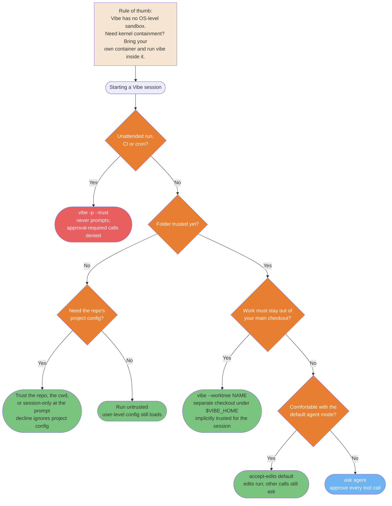

# Security and Production Diagrams

> **Verified against vibe 2.25.8 on 2026-09-24.** Documented surface: release 2.25.8.

## TL;DR

- Defense in depth in Vibe is three layers: prevention (trust gate, supply-chain
  vetting, `AGENTS.md` rules, agent modes and bash allow/deny lists), detection
  (`pre_tool`/`post_tool` hooks, session logs), and response (DIY container
  isolation, approval gates, containment controls).
- Vibe has **no OS-level sandbox**. The isolation decision tree routes you through
  the verified surfaces instead: trusted folders, `--worktree`, and programmatic
  mode's never-prompt, deny-by-default posture.
- Never let the model verify its own work; route verification through humans,
  tests, and other tooling.
- CI runs are `vibe -p` bounded by `--max-turns` / `--max-price` / `--max-tokens`
  with `--output json`; approval-required tool calls are denied, not approved.

**Read if** you run Vibe against production systems, untrusted repositories, or in
CI. **Skip if** you only need the install and first-run basics — start with
[Module 01](../learning-path/01-installation.md) instead.

---

## Security 3-Layer Defense Model

Defense in depth for Vibe: prevention stops most threats, detection catches what
slips through, and response limits blast radius. No single layer is sufficient.
The layers map to Vibe's verified surfaces: the trust gate (PART-TRUST), hooks as
guards with `strict = true` to fail closed (PART-HOOKS), and agent modes plus
bash allow/deny lists (PART-PERMISSIONS).

```mermaid
flowchart LR
    THREAT([Threat / attack]) --> L1

    subgraph L1["Layer 1: Prevention"]
        P1["MCP and skill vetting<br/>disabled / disabled_tools entries"]
        P2["Trust gate<br/>project config only from trusted roots"]
        P3["AGENTS.md restrictions<br/>forbidden actions, data rules"]
        P4["Agent modes and bash lists<br/>allowlist / denylist, no --yolo on the host"]
    end

    subgraph L2["Layer 2: Detection"]
        D1["pre_tool hooks<br/>audit every tool call"]
        D2["Session logs<br/>complete history in ~/.vibe/logs/session/"]
        D3["post_tool secrets scanner<br/>on bash output"]
    end

    subgraph L3["Layer 3: Response"]
        R1["DIY container isolation<br/>no builtin sandbox"]
        R2["Approval gates<br/>ask agent prompts per call"]
        R3["Containment controls<br/>vibe mcp remove, /loop cancel, per-tool never"]
    end

    L1 -->|Bypassed| L2
    L2 -->|Bypassed| L3
    L3 --> BLOCKED([Threat contained])

    style THREAT fill:#E85D5D,color:#fff
    style P1 fill:#7BC47F,color:#333
    style P2 fill:#7BC47F,color:#333
    style P3 fill:#7BC47F,color:#333
    style P4 fill:#7BC47F,color:#333
    style D1 fill:#6DB3F2,color:#fff
    style D2 fill:#6DB3F2,color:#fff
    style D3 fill:#6DB3F2,color:#fff
    style R1 fill:#E87E2F,color:#fff
    style R2 fill:#E87E2F,color:#fff
    style R3 fill:#E87E2F,color:#fff
    style BLOCKED fill:#7BC47F,color:#333

    click THREAT href "../security/security-hardening.md#1-the-local-boundary-stated-correctly" "Threat / attack"
    click P1 href "../security/security-hardening.md#3-prevention-vetting-the-supply-chain" "MCP and skill vetting"
    click P2 href "../security/security-hardening.md#33-repo-borne-config-the-trust-gate-is-the-defense" "Trust gate"
    click P3 href "../security/security-hardening.md#72-charter-compact-template" "AGENTS.md restrictions"
    click P4 href "../security/security-hardening.md#41-per-tool-rules-in-configtoml" "Agent modes and bash lists"
    click D1 href "../security/security-hardening.md#43-hooks-three-events-a-json-contract-and-fail-open-by-default" "pre_tool hooks"
    click D2 href "../security/security-hardening.md#71-local-vs-shared" "Session logs"
    click D3 href "../security/security-hardening.md#61-secret-exposed" "post_tool secrets scanner"
    click R1 href "../security/security-hardening.md#51-container-isolation-is-diy" "DIY container isolation"
    click R2 href "../security/security-hardening.md#73-the-four-tier-guardrail-ladder" "Approval gates"
    click R3 href "../security/security-hardening.md#63-kill-switch" "Containment controls"
    click BLOCKED href "../security/security-hardening.md#6-response-playbooks-when-things-go-wrong" "Threat contained"
```



<details>
<summary>ASCII version</summary>

```text
Threat
  |
Layer 1: PREVENTION
  - MCP/skill vetting + trust gate + AGENTS.md rules + agent modes and bash lists
  | (bypassed) ->
Layer 2: DETECTION
  - pre_tool audits + session logs + post_tool scanners
  | (bypassed) ->
Layer 3: RESPONSE
  - DIY containers + approval gates + containment controls
  |
Contained
```

</details>

> **Source**: [Security Hardening](../security/security-hardening.md), section 4 and section 7.

---

## Isolation Decision Tree

Vibe has no OS-level sandbox — no Seatbelt/bubblewrap-class containment exists in
the verified surface. Isolation comes from the verified surfaces instead: the
trust model (PART-TRUST), `--worktree` checkouts (PART-WORKTREES), and
programmatic mode, which never prompts and auto-denies approval-required calls
(PART-CLI). Use this tree to decide which surface your situation needs; add a
container of your own only when you need kernel-level containment.



<details>
<summary>ASCII version</summary>

```text
Unattended run (CI/cron)? -> YES -> vibe -p --trust (never prompts, denies approvals)
     | No
Folder trusted yet?
  |- No -> Need the repo's project config?
  |        |- Yes -> Trust at the prompt (repo / cwd / session-only; decline ignores it)
  |        +- No  -> Run untrusted (user-level config still loads)
  +- Yes -> Work must stay out of your main checkout?
             |- Yes -> vibe --worktree NAME (separate checkout, session trust)
             +- No  -> Comfortable with the default agent mode?
                        |- Yes -> accept-edits (edits run, others ask)
                        +- No  -> ask agent (approve every call)

Rule: no OS-level sandbox exists. Need kernel containment? Bring your own container.
```

</details>

> **Source**: [Security Hardening, section 5: Isolation beyond the built-in boundary](../security/security-hardening.md#5-isolation-beyond-the-built-in-boundary).

---

## The Verification Paradox

Asking the agent to verify its own work is circular. The same model that produced
the bug will often miss it during review. This anti-pattern causes production
incidents; the fix is independent verification channels.

```mermaid
flowchart TD
    subgraph BAD["Anti-Pattern: Circular Verification"]
        BA([The agent writes code]) --> BB("Ask the same agent:<br/>'Is this correct?'")
        BB --> BC{"Agent says:<br/>'Yes, looks good!'"}
        BC -->|Deploy| BD([Bug in production])
        BC --> BE["Why it fails:<br/>Same model<br/>Same training biases<br/>Same blind spots"]
        style BA fill:#E85D5D,color:#fff
        style BD fill:#E85D5D,color:#fff
        style BE fill:#E85D5D,color:#fff
        style BC fill:#E87E2F,color:#fff
    end

    subgraph GOOD["Best Practice: Independent Verification"]
        GA([The agent writes code]) --> GB("Human reviews<br/>critical sections")
        GA --> GC("Automated test suite<br/>runs independently")
        GA --> GD("Different tool validates<br/>linters, type checkers, scanners")
        GB & GC & GD --> GE{All checks<br/>pass?}
        GE -->|Yes| GF([Safe to deploy])
        GE -->|No| GG([Fix before deploy])
        style GA fill:#7BC47F,color:#333
        style GB fill:#7BC47F,color:#333
        style GC fill:#7BC47F,color:#333
        style GD fill:#7BC47F,color:#333
        style GF fill:#7BC47F,color:#333
        style GE fill:#E87E2F,color:#fff
        style GG fill:#6DB3F2,color:#fff
    end

    click BA href "../workflows/production-reliability.md#anti-patterns" "The agent writes code (anti-pattern)"
    click BB href "../workflows/production-reliability.md#anti-patterns" "Ask the same agent"
    click BC href "../workflows/production-reliability.md#anti-patterns" "Agent says looks good"
    click BD href "../workflows/production-reliability.md#anti-patterns" "Bug in production"
    click BE href "../workflows/production-reliability.md#anti-patterns" "Why it fails"
    click GA href "../workflows/production-reliability.md#running-the-checks-with-vibe" "The agent writes code (best practice)"
    click GB href "../workflows/production-reliability.md#structured-human-handoff" "Human reviews critical sections"
    click GC href "../workflows/production-reliability.md#running-the-checks-with-vibe" "Automated test suite"
    click GD href "../workflows/production-reliability.md#running-the-checks-with-vibe" "Different tool validates"
    click GE href "../workflows/production-reliability.md#running-the-checks-with-vibe" "All checks pass?"
    click GF href "../workflows/production-reliability.md#running-the-checks-with-vibe" "Safe to deploy"
    click GG href "../workflows/production-reliability.md#running-the-checks-with-vibe" "Fix before deploy"
```



<details>
<summary>ASCII version</summary>

```text
BAD:  agent writes -> agent checks itself -> "looks good" -> deploy -> bug
      (same model, same biases, circular)

GOOD: agent writes -> human reviews (critical sections)
                   -> automated tests (independent)
                   -> static analysis (different tool)
                   -> all pass? -> deploy
```

</details>

> **Source**: [Production Reliability Patterns](../workflows/production-reliability.md).

---

## CI/CD Integration Pipeline

Vibe runs non-interactive inside CI/CD with `vibe -p`: send a prompt, get output,
exit. Bound every run with `--max-turns`, `--max-price`, and `--max-tokens`, and
read results with `--output json` (PART-CLI). Programmatic mode never prompts and
**auto-denies approval-required tool calls** — live-verified, not inferred from
docs (PART-CLI, the live tests). Enforce repo policy with `hooks.toml` guards set
to `strict = true` so a failed check denies instead of proceeding (PART-HOOKS
section 3.3).

```mermaid
flowchart LR
    PR([PR created]) --> GH{CI trigger<br/>push or PR event}
    GH --> ENV["Export MISTRAL_API_KEY<br/>vibe --trust for the checkout"]
    ENV --> CC["vibe -p 'Run quality checks'<br/>--max-turns --max-price --max-tokens<br/>--output json"]

    CC --> subgraph TASKS["Parallel checks"]
        T1["Lint check<br/>project linter"]
        T2["Test suite<br/>project runner"]
        T3["Security scan<br/>strict pre_tool guards"]
        T4["Doc completeness<br/>check exports"]
    end

    T1 & T2 & T3 & T4 --> AGG{All<br/>checks pass?}
    AGG -->|Yes| OK([Checks green<br/>human review next])
    AGG -->|No| FAIL([Report failures<br/>on the PR])
    FAIL --> FIX([Developer fixes<br/>re-trigger CI])
    FIX --> CC

    style PR fill:#F5E6D3,color:#333
    style GH fill:#B8B8B8,color:#333
    style CC fill:#E87E2F,color:#fff
    style T1 fill:#6DB3F2,color:#fff
    style T2 fill:#6DB3F2,color:#fff
    style T3 fill:#6DB3F2,color:#fff
    style T4 fill:#6DB3F2,color:#fff
    style AGG fill:#E87E2F,color:#fff
    style OK fill:#7BC47F,color:#333
    style FAIL fill:#E85D5D,color:#fff
    style FIX fill:#F5E6D3,color:#333

    click PR href "../ops/automation.md#2-programmatic-mode-for-cicd-stable" "PR created"
    click GH href "../ops/automation.md#2-programmatic-mode-for-cicd-stable" "CI trigger"
    click ENV href "../ops/automation.md#4-ci-pattern-sketches" "Set up environment"
    click CC href "../security/production-safety.md#headless-runs-and-ci-safety-stable" "vibe -p headless run"
    click T1 href "../workflows/production-reliability.md#running-the-checks-with-vibe" "Lint check"
    click T2 href "../workflows/production-reliability.md#running-the-checks-with-vibe" "Test suite"
    click T3 href "../security/security-hardening.md#43-hooks-three-events-a-json-contract-and-fail-open-by-default" "Security scan"
    click T4 href "../security/production-safety.md#verification-before-completion" "Doc completeness"
    click AGG href "../ops/automation.md#auto-deny-is-the-default-posture" "All checks pass?"
    click OK href "../security/production-safety.md#verification-before-completion" "Checks green"
    click FAIL href "../workflows/production-reliability.md#structured-error-propagation" "Report failures on PR"
    click FIX href "../ops/automation.md#4-ci-pattern-sketches" "Developer fixes"
```

<details>
<summary>ASCII version</summary>

```text
PR created -> CI trigger -> export MISTRAL_API_KEY, vibe --trust
                                |
                  vibe -p 'Run quality checks'
                  --max-turns --max-price --max-tokens --output json
                                |
                +---------------+----------------+
              Lint           Tests          Security scan
                                |
                      All pass? --No--> fail the PR + report
                        | Yes
                      Checks green -> human review -> merge
```

</details>

> **Source**: [Automation: Headless CI Runs](../ops/automation.md) and [Production Safety Rules](../security/production-safety.md#headless-runs-and-ci-safety-stable).

---

## Known gaps

- **No OS-level sandbox.** The source guide's sandbox decision tree (Docker /
  Firecracker / OS sandboxing as product features) does not port: Vibe has no
  sandbox flag or subcommand. The isolation tree above is re-shaped to the
  verified surfaces — trust, `--worktree`, programmatic mode — and container
  isolation remains DIY infrastructure you add yourself
  ([Security Hardening section 5.1](../security/security-hardening.md#51-container-isolation-is-diy)).
- **Hooks fail open by default.** A broken guard lets the gated call proceed
  unless the hook sets `strict = true` (PART-HOOKS section 3.3). Every "hook as
  CI policy" node above assumes `strict = true`.
- **No anomaly alerting.** The source's "anomaly alerts" detection node has no
  Vibe mechanic; the re-labeled layer 2 uses what is verified: hook audits and
  the session log store (PART-SESSIONS section 3.1).
- **Auto-DENY is live-verified on 2.25.0** (PART-CLI, the recorded programmatic
  runs); deltas in release 2.25.8 were verified from source only and were not
  live-executed.
