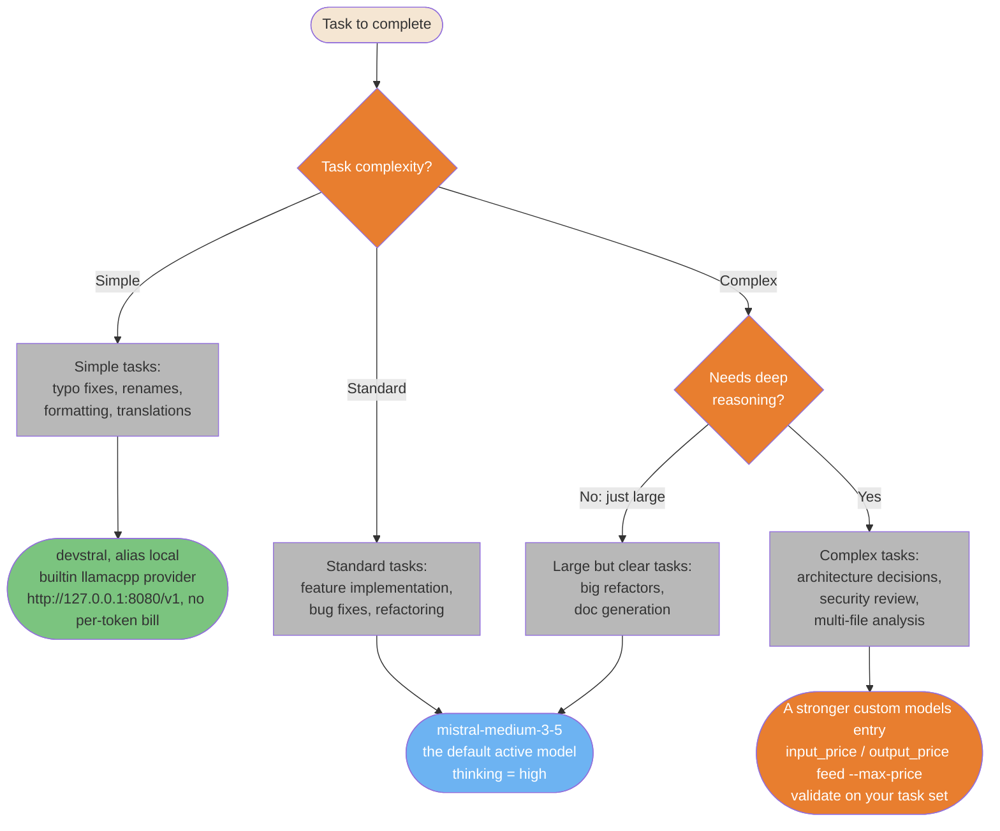
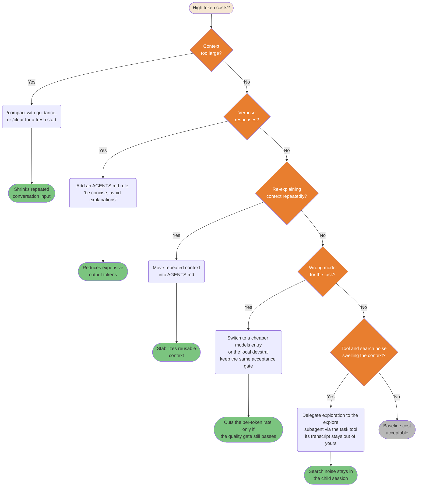

# Cost and Optimization Diagrams

> **Verified against vibe 2.25.8 on 2026-09-24.** Documented surface: release 2.25.8.

## TL;DR

- Model choice is config, not a menu: `active_model` plus `[[models]]` entries whose
  `input_price` / `output_price` feed the `--max-price` budget (PART-CONFIG section
  1.1); switch with `/model`, restrict with `allowed_models` (PART-SESSIONS section
  3.5).
- High token costs are usually fixable: compact, tighten `AGENTS.md`, pick the right
  model, and delegate noisy exploration to subagents.
- Token-reduction strategies overlap — apply one at a time and measure cost per
  accepted task.
- Bound every unattended run with `--max-turns`, `--max-price`, `--max-tokens`
  (PART-CLI).

**Read if** you pay per token or run Vibe unattended and need to cap spend.
**Skip if** cost is not a constraint for you; the compaction background in
[Context Engineering](../core/context-engineering.md) is enough.

---

## Model Selection Decision Flow

Not all tasks need the most capable model. In Vibe, the candidates are config
entries: the default active model (`mistral-medium-3-5`, thinking high), the local
`devstral` entry on the builtin `llamacpp` provider, and any custom `[[models]]`
entry you define with its own `input_price` / `output_price` (PART-CONFIG section
1.1). A cheaper entry saves money only when it passes the same task acceptance
gate without increasing retries, review, or rework. `/thinking` tunes the thinking
level in-session; `/model` switches and persists the pin (PART-COMMANDS section 2;
PART-SESSIONS section 3.5).



For unattended runs, set the budgets before debating models: `--max-price DOLLARS`
interrupts a session when cost exceeds the limit, `--max-turns` caps assistant
turns, `--max-tokens` caps total prompt plus completion tokens (all programmatic
mode, PART-CLI).

<details>
<summary>ASCII version</summary>

```text
Task complexity?
|- Simple (typos, format, rename)     -> devstral / local      (llamacpp, no per-token bill)
|- Standard (features, bug fixes)      -> mistral-medium-3-5    (default active model, validate)
+- Complex (architecture, security)
   |- Needs deep reasoning?            -> stronger custom [[models]] entry (validate on your tasks)
   +- Just large/clear?               -> mistral-medium-3-5    (handles it)

Unattended runs: set --max-turns / --max-price / --max-tokens first (PART-CLI).
```

</details>

> **Source**: [Settings Reference: Models and providers](../core/settings-reference.md#models-and-providers--stable).

---

## Cost Optimization Decision Tree

High token costs are usually fixable. This tree identifies the root cause and
points to the right verified fix for each waste pattern: compaction and the
compaction trigger (PART-SESSIONS section 4.1), stable `AGENTS.md` context
(PART-AGENTSMD), model entries (PART-CONFIG section 1.1), and delegation to
subagents so search noise stays in the child session (PART-AGENTS section 9).



<details>
<summary>ASCII version</summary>

```text
High costs?
|- Context too large?      -> /compact or /clear           (less repeated input)
|- Verbose responses?      -> AGENTS.md: be concise        (fewer output tokens)
|- Repeating context?      -> Move it into AGENTS.md       (stable reusable prefix)
|- Wrong model?            -> Cheaper entry, same gate     (validate first)
|- Search noise?           -> Delegate to the explore subagent (noise stays in the child)
+- None of the above?      -> Baseline cost, acceptable
```

</details>

> **Source**: [Context Engineering: compaction](../core/context-engineering.md#compaction-is-a-trigger-not-a-window) and [Team Metrics: AI-specific metrics](../ops/team-metrics.md#ai-specific-metrics).

---

## Token Reduction Strategies Pipeline

Multiple strategies reduce the same token classes, so their effects cannot be
multiplied. Apply them one at a time, measure, and retain only the changes that
reduce cost per accepted task. Each stage below is a verified mechanic: `@`
mentions re-read the file as a synthetic `read_file` on every mention
(PART-SESSIONS section 6.1); compaction fires at `auto_compact_threshold` (default
200,000 tokens, `0` disables) and `/compact` accepts custom instructions with
`compaction_prompt_id` swapping the prompt (PART-SESSIONS section 4); `AGENTS.md`
provides stable instructions (PART-AGENTSMD); skills load their body only on
invocation (PART-SKILLS section 1.4).

```mermaid
flowchart LR
    BASE([Baseline:<br/>100% tokens]) --> MENT

    subgraph MENT["Strategy 1: @ mentions"]
        M1["Every mention re-reads the file<br/>fresh tool result each turn"]
        M2["Caps: 2000 lines, 50 KB per file,<br/>8 file mentions per prompt"]
        M3["Mention only what<br/>the task needs"]
    end

    MENT --> COMP

    subgraph COMP["Strategy 2: compaction"]
        C1["auto_compact_threshold<br/>default 200,000; 0 disables"]
        C2["/compact with custom instructions<br/>compaction_prompt_id swaps the prompt"]
        C3["Reduces future<br/>history input"]
    end

    COMP --> AGMD

    subgraph AGMD["Strategy 3: AGENTS.md"]
        CM1["Repeated context<br/>becomes persistent instructions"]
        CM2["No re-explaining<br/>project conventions"]
        CM3["Stable, reusable<br/>prompt prefix"]
    end

    AGMD --> SKILL

    subgraph SKILL["Strategy 4: skills"]
        S1["Only the description is visible<br/>until the skill loads"]
        S2["Body loads on invocation;<br/>support files on demand"]
        S3["Procedures stay out of<br/>the always-on context"]
    end

    SKILL --> RESULT([Measure: cost per accepted task<br/>before and after])

    style BASE fill:#E85D5D,color:#fff
    style M3 fill:#7BC47F,color:#333
    style C3 fill:#7BC47F,color:#333
    style CM3 fill:#7BC47F,color:#333
    style S3 fill:#7BC47F,color:#333
    style RESULT fill:#7BC47F,color:#333

    click BASE href "../ops/team-metrics.md#ai-specific-metrics" "Baseline: 100% tokens"
    click M1 href "../core/context-engineering.md#2-the-context-budget" "Mentions re-read files"
    click M2 href "../core/context-engineering.md#2-the-context-budget" "Mention caps"
    click M3 href "../core/context-engineering.md#2-the-context-budget" "Mention only what is needed"
    click C1 href "../core/context-engineering.md#compaction-is-a-trigger-not-a-window" "Compaction trigger"
    click C2 href "../core/context-engineering.md#compaction-is-a-trigger-not-a-window" "/compact with custom prompt"
    click C3 href "../core/context-engineering.md#compaction-is-a-trigger-not-a-window" "Reduce future history input"
    click CM1 href "../core/memory-systems.md#21-agentsmd-the-instruction-hierarchy" "Repeated context persistent"
    click CM2 href "../core/memory-systems.md#21-agentsmd-the-instruction-hierarchy" "No re-explaining conventions"
    click CM3 href "../core/memory-systems.md#21-agentsmd-the-instruction-hierarchy" "Stable reusable prefix"
    click S1 href "../core/context-engineering.md#progressive-disclosure" "Description-only routing"
    click S2 href "../core/context-engineering.md#progressive-disclosure" "Body loads on invocation"
    click S3 href "../core/context-engineering.md#progressive-disclosure" "Procedures out of always-on context"
    click RESULT href "../ops/team-metrics.md#ai-specific-metrics" "Measure cost per accepted task"
```



<details>
<summary>ASCII version</summary>

```text
100% baseline
    |
@ mentions (each mention re-reads; caps 2000 lines / 50 KB / 8 files)  -> mention less
    |
Compaction (trigger at auto_compact_threshold; /compact with guidance)  -> less history later
    |
AGENTS.md (stable project instructions)                                 -> reusable prefix
    |
Skills (description routes; body loads on invocation)                  -> procedures on demand
    |
Measure total cost per accepted task before and after
```

</details>

> **Source**: [Context Engineering](../core/context-engineering.md) and [Memory Systems](../core/memory-systems.md#21-agentsmd-the-instruction-hierarchy).

---

## Known gaps

- **The source's "Subscription Tiers" diagram is dropped, mandated by the porting
  plan.** It documented one vendor's plan pricing; the oracle verifies no plan,
  quota, or pricing mechanics for Vibe (org commercial surfaces have no oracle
  mechanics at all), so no re-labeling could make it true.
- **The source's "RTK proxy" strategy is dropped**: it is third-party output
  filtering with no Vibe mechanic. The verified output-side controls are the bash
  tool's `max_output_bytes` cap (PART-CONFIG section 1.3) and `post_tool` hooks
  that replace tool output text (PART-HOOKS section 3.3).
- **No public token rates are stated as fact.** `input_price` / `output_price` are
  per-model config values you supply (PART-CONFIG section 1.1); whatever rates
  your provider charges, check its pricing page before a purchasing decision.
- The `/usage` and `/effort` commands in the source do not exist in Vibe's
  verified command list (PART-COMMANDS section 2); `/status` shows agent
  statistics and `/thinking` selects the thinking level instead.
