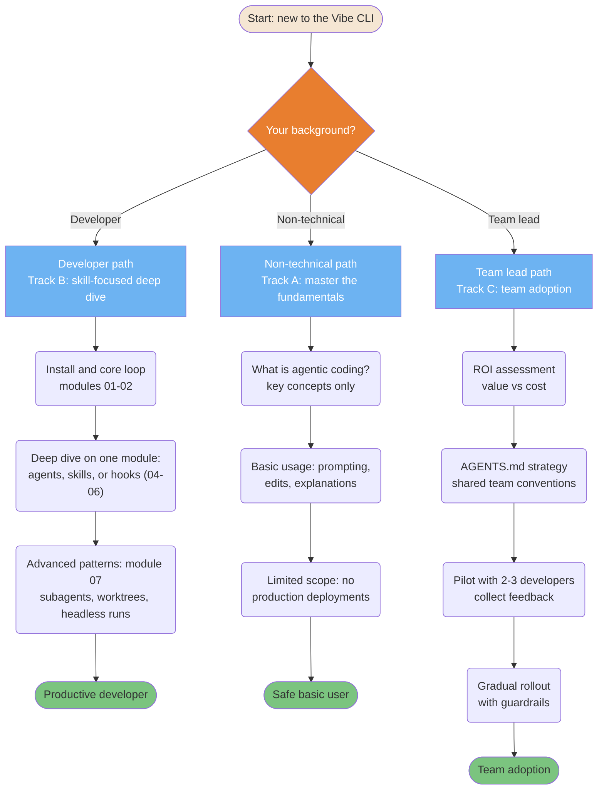
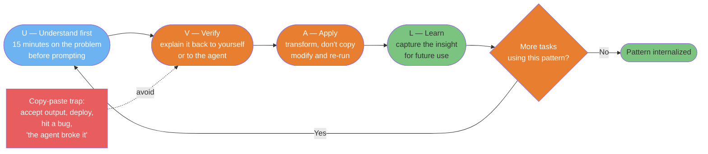
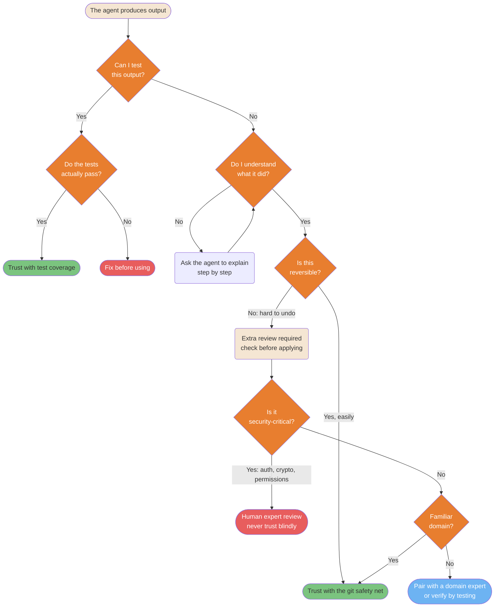

# Adoption and Learning Diagrams

> **Verified against vibe 2.25.8 on 2026-09-24.** Documented surface: release 2.25.8.

## TL;DR

- Onboard by background: developers take the skill-focused deep dive,
  non-technical users take the fundamentals track, team leads take the team
  adoption track ([Learning Path](../learning-path/README.md#step-2-choose-your-track)).
- Start turnkey (minimal `AGENTS.md`, iterate on friction) or autonomous
  (concepts first, configure when needed) — both are documented starting points
  ([Adoption Approaches](../roles/adoption-approaches.md)).
- The UVAL protocol (Understand, Verify, Apply, Learn) prevents the copy-paste
  trap.
- Calibrate trust per output: testable outputs earn trust through tests;
  everything else routes through review, reversibility, and domain expertise.

**Read if** you are adopting Vibe yourself or rolling it out to a team. **Skip
if** you want the mechanics reference only — go to
[Agents and Skills Reference](../core/agents-and-skills-reference.md).

---

## Onboarding Adaptive Learning Paths

Different backgrounds need different routes. Forcing developers through a beginner
path wastes time; dropping non-technical users into orchestration causes
frustration. The routes below re-label to the learning path's three tracks
(PART-AGENTSMD for the `AGENTS.md` strategy step; PART-CLI for the first run).



<details>
<summary>ASCII version</summary>

```text
Your background?
|- Developer (Track B, skill-focused):
|  install + core loop -> deep dive (agents/skills/hooks) -> advanced patterns
|- Non-technical (Track A, fundamentals):
|  what is agentic coding? -> basic usage -> limited scope (no prod deploys)
+- Team lead (Track C, team adoption):
   ROI assessment -> AGENTS.md strategy -> pilot 2-3 devs -> gradual rollout
```

</details>

> **Source**: [Learning Path: Choose Your Track](../learning-path/README.md#step-2-choose-your-track) and [Adoption Approaches](../roles/adoption-approaches.md).

---

## The UVAL Protocol

The UVAL protocol prevents the copy-paste trap: using the agent without
understanding what it did. Each cycle builds real competency that survives tool
unavailability.



<details>
<summary>ASCII version</summary>

```text
UNDERSTAND -> VERIFY -> APPLY -> LEARN -> (repeat with the next task)

U: 15 minutes on the problem before prompting
V: explain it back to yourself or the agent   <- anti: just copy-paste
A: transform, don't copy; modify and re-run
L: capture the insight for future use

Anti-pattern (avoid): accept output -> deploy -> bug -> "the agent broke it"
```

</details>

> **Source**: [Learning with AI: the UVAL protocol](../roles/learning-with-ai.md#the-uval-protocol).

---

## Trust Calibration Matrix

Knowing when to trust agent output and when to verify is the core skill of
AI-assisted development. Over-trust causes bugs; under-trust eliminates the
productivity gains. Vibe gives you two starting-posture levers: the trust prompt
that gates project config (PART-TRUST section 3.2) and the agent modes — `ask`,
`plan`, `accept-edits`, `auto-approve` (PART-PERMISSIONS section 4.1). The rest is
judgment:



<details>
<summary>ASCII version</summary>

```text
Can I test it?
|- Yes -> Tests pass? -> Yes -> trust with tests
|                     -> No  -> fix before using
+- No  -> Do I understand it?
          |- No  -> ask the agent to explain -> understand -> continue
          +- Yes -> Is it reversible?
                    |- Yes    -> trust with the git safety net
                    +- No     -> security-critical?
                                 |- Yes -> human expert review (never skip)
                                 +- No  -> familiar domain?
                                           |- Yes -> trust with care
                                           +- No  -> pair with an expert
```

</details>

> **Source**: [Module 01: trust decisions](../learning-path/01-installation.md#exercise-3-make-a-trust-decision) and [Adoption Approaches: sanity checks](../roles/adoption-approaches.md#sanity-checks).

---

## Known gaps

- **Time-to-productivity estimates are the learning path's planning numbers, not
  oracle mechanics.** The learning path's hour ranges (per module and per track)
  are the source of the track labels; nothing in the verified surface measures
  onboarding speed.
- **UVAL is a practice, not a product mechanic.** The protocol is methodology; the
  only Vibe surfaces it touches are the `post_agent` hook capture pattern
  documented in [Learning with AI](../roles/learning-with-ai.md#the-uval-protocol).
- **No assessment tooling.** The CLI ships no quiz or self-assessment command;
  validation is checklist-only (PART-COMMANDS section 2).
- The source's trust matrix leaned on a plan-verification feature; this version
  is re-anchored to the verified trust prompt and agent modes (PART-TRUST section
  3.2; PART-PERMISSIONS section 4.1).
