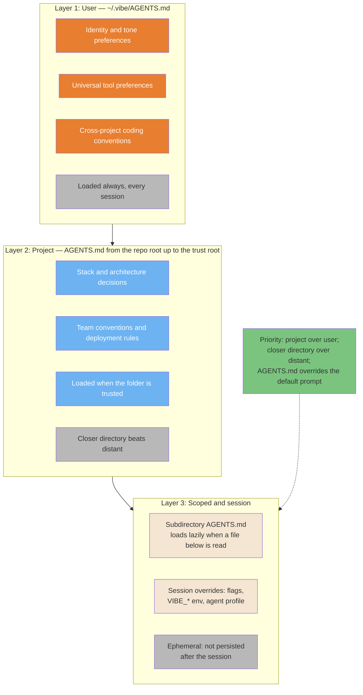
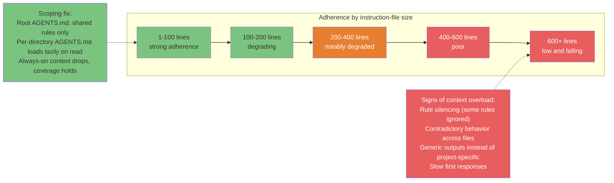
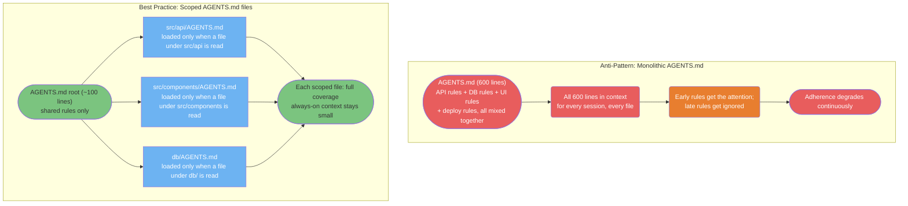
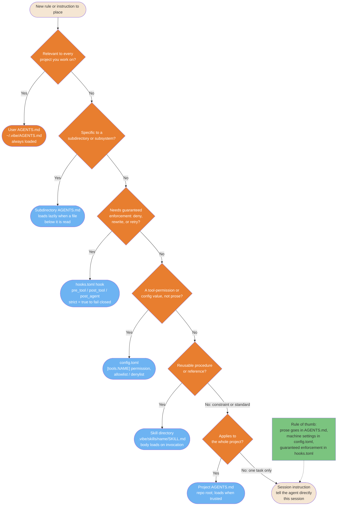

# Context Engineering Diagrams

> **Verified against vibe 2.25.8 on 2026-09-24.** Documented surface: release 2.25.8.

## TL;DR

- Vibe's instruction context is layered: user `AGENTS.md` (always loaded),
  project `AGENTS.md` from the repo root up to the trust root (loaded when
  trusted), subdirectory `AGENTS.md` (lazy, on read), plus session-level
  overrides (PART-AGENTSMD).
- Adherence to instructions degrades as the always-on block grows; scoping rules
  to the directories they govern is the fix.
- A monolithic `AGENTS.md` is the common failure mode; scoped per-directory files
  keep coverage while shrinking always-on context.
- Place each rule deliberately: prose in `AGENTS.md`, machine settings in
  `config.toml`, guaranteed enforcement in `hooks.toml`.

**Read if** you maintain `AGENTS.md` files or context costs are hurting output
quality. **Skip if** you want the theory first — read
[Context Engineering](../core/context-engineering.md), then come back for the
decision trees.

---

## The 3-Layer Context System

Context engineering operates across distinct layers with different scopes and
persistence. Understanding which layer to use prevents the most common mistake:
cramming everything into one file. In Vibe the layers are `AGENTS.md` levels plus
the session: `~/.vibe/AGENTS.md` always loads; project files load from each open
root up to its trust root when the folder is trusted; subdirectory files load
lazily when a file below them is read (PART-AGENTSMD).



<details>
<summary>ASCII version</summary>

```text
USER     ~/.vibe/AGENTS.md                    -> identity, universal tools, cross-project rules (always loaded)
    | overridden by
PROJECT  repo-root AGENTS.md up to trust root -> stack, architecture, team rules (loaded when trusted)
    | overridden by
SESSION  subdirectory AGENTS.md + overrides   -> scoped rules (lazy), flags and env (ephemeral)

Priority: project over user; closer directory over distant;
AGENTS.md instructions override the default system prompt.
```

</details>

> **Source**: [Context Engineering: the AGENTS.md instruction hierarchy](../core/context-engineering.md#3-the-agentsmd-instruction-hierarchy).

---

## Context Budget and Adherence Degradation

Adherence to instruction files degrades predictably as the always-on block grows:
beyond a few hundred lines, models begin selectively ignoring rules. Directory
scoping is the primary fix — the subdirectory `AGENTS.md` mechanism keeps full
coverage while shrinking what loads every turn (PART-AGENTSMD). The zone labels
below are qualitative, carried from the source guide's practitioner reporting;
treat the shape as directional, not as measured percentages.



<details>
<summary>ASCII version</summary>

```text
Lines in the file     Adherence    Status
-----------------    ---------    ------
1 - 100              ~95%         green zone
100 - 200            ~88%         acceptable
200 - 400            ~75%          caution
400 - 600            ~60%          degraded
600+                 ~45% falling  critical

Fix: scope rules per directory; the root AGENTS.md keeps shared rules only.
Subdirectory files load lazily when a file below them is read.
Result: smaller always-on context, coverage holds, adherence stays high.
```

</details>

> **Source**: [Context Engineering: the context budget](../core/context-engineering.md#2-the-context-budget).

---

## Monolithic vs. Modular Instruction Architecture

The monolithic `AGENTS.md` is the most common failure mode in team contexts.
Per-directory `AGENTS.md` files fix it: Vibe loads a subdirectory file only when
a file below it is read, so only what is relevant for the current task enters
context (PART-AGENTSMD).



<details>
<summary>ASCII version</summary>

```text
BAD: AGENTS.md (600 lines, everything mixed)
  -> all 600 lines in context every session
  -> late rules get ignored
  -> adherence degrades continuously

GOOD: root AGENTS.md (~100 lines, shared rules only)
  + src/api/AGENTS.md        <- loaded only when a file under src/api is read
  + src/components/AGENTS.md <- loaded only when a file under src/components is read
  + db/AGENTS.md             <- loaded only when a file under db/ is read

Result: small always-on context, full coverage per subsystem.
```

</details>

> **Source**: [Context Engineering: the path-scoping pattern](../core/context-engineering.md#the-path-scoping-pattern).

---

## Rule Placement Decision Tree

Every new instruction needs to land in the right layer. Wrong placement wastes
tokens (too global) or loses coverage (too scoped). This tree adds the
`config.toml` versus `hooks.toml` boundary to the `AGENTS.md` levels: prose rules
go in `AGENTS.md` (PART-AGENTSMD), machine-enforced settings in `config.toml`
(PART-CONFIG), and anything that must guarantee a deny, rewrite, or retry goes in
`hooks.toml` with `strict = true` (PART-HOOKS).



<details>
<summary>ASCII version</summary>

```text
New rule to place
|
Relevant to every project?            --Yes--> user AGENTS.md (~/.vibe/AGENTS.md, always loaded)
| No
Specific to a subdirectory?           --Yes--> subdirectory AGENTS.md (lazy, on read)
| No
Needs guaranteed enforcement?         --Yes--> hooks.toml (strict = true to fail closed)
| No
A tool-permission / config value?     --Yes--> config.toml ([tools.NAME] tables)
| No
Reusable procedure or reference?      --Yes--> skill (.vibe/skills/name/SKILL.md, loads on invocation)
| No
Applies to the whole project?         --Yes--> project AGENTS.md root (loads when trusted)
| No
+--> session instruction (ephemeral)

Rule of thumb: prose -> AGENTS.md; settings -> config.toml; enforcement -> hooks.toml.
```

</details>

> **Source**: [Context Engineering: decision tree — where does this rule go?](../core/context-engineering.md#decision-tree-where-does-this-rule-go) and [Memory Systems: the instruction hierarchy](../core/memory-systems.md#21-agentsmd-the-instruction-hierarchy).

---

## Known gaps

- **Adherence degradation is qualitative** (carried from the source guide's
  practitioner reporting), not oracle-verified measurement. The
  oracle verifies the loading mechanics, not adherence rates.
- **No `@import` / include syntax in `AGENTS.md`.** The source's path-scoped
  `@import` modules do not port: PART-AGENTSMD verifies no include mechanic. The
  scoped-module diagrams use the verified equivalent — subdirectory `AGENTS.md`
  files that load lazily on read.
- **No line-count limits are mechanics.** The source's "under 200 lines / under
  150 lines" targets are heuristics; the labels here describe behavior
  (always-loaded, lazy) rather than invented thresholds.
- Session-layer overrides in the layer diagram cover the verified stack
  (session overrides, agent profile, `VIBE_*` env — PART-CONFIG section 2.1);
  the AdminConfigLayer sits above them for org-enforced config.
