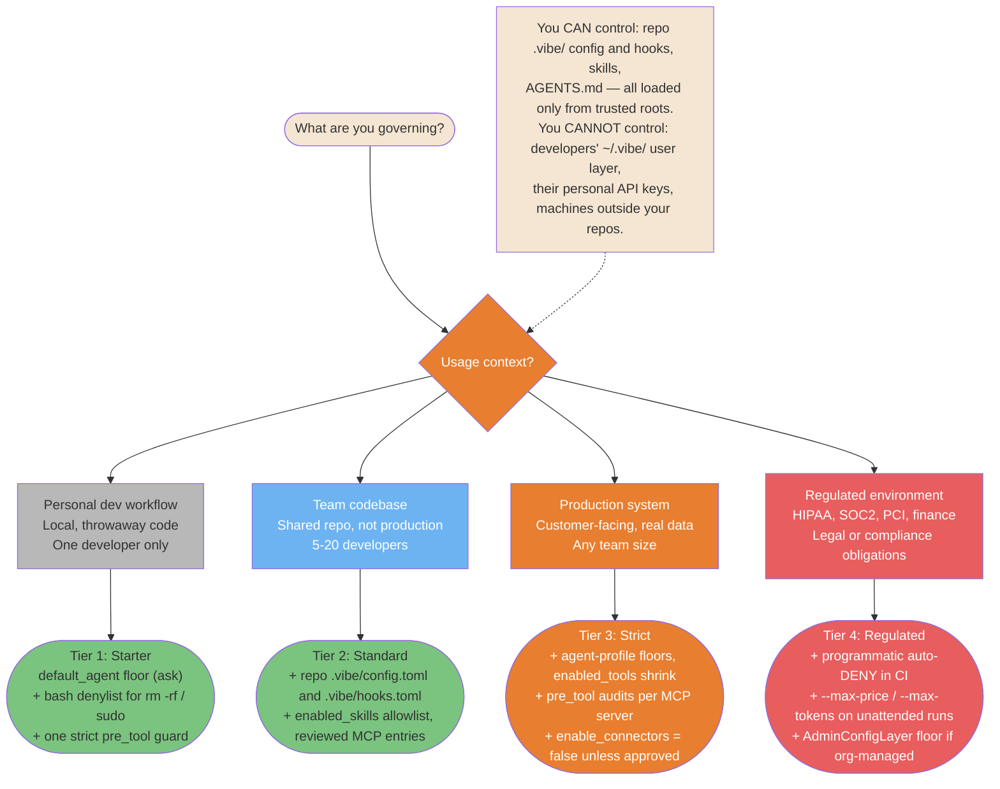
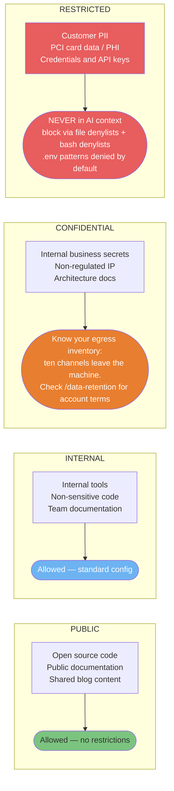

# Enterprise Governance Diagrams

> **Verified against vibe 2.25.8 on 2026-09-24.** Documented surface: release 2.25.8.

Org-level patterns for teams deploying Vibe at scale: governance tiers, MCP
approval workflows, and data classification. The tier names and controls mirror
[Security Hardening, section 7](../security/security-hardening.md#7-tiered-governance).

> **Audience**: tech leads, engineering managers, security officers. For
> individual-developer security see
> [Security and Production Diagrams](./08-security-and-production.md).

## TL;DR

- Match governance weight to risk: the four-tier ladder (Starter, Standard,
  Strict, Regulated) says what each tier can actually enforce with verified
  mechanics.
- MCP governance is a process you own: Vibe reads no registry; `vibe mcp add`
  writes the user layer only, so repo distribution is a committed `[[mcp_servers]]`
  entry in the trusted project's `config.toml` (PART-MCP; PART-CONFIG section 1.4).
- Data classification decides what may enter a context window at all; RESTRICTED
  never does, and the file-plus-shell denylist pair is the enforcement.

**Read if** you set policy for multiple developers or govern repos with customer
or regulated data. **Skip if** you are a solo developer —
[Security Hardening](../security/security-hardening.md) covers your case in
section 7.1.

---

## Governance Risk Tiers: What to Control and When

Not everything needs heavy governance. This tree routes your context to the
right control level based on actual risk, from personal dev workflow (minimal) to
regulated environments (full compliance stack). The tiers mirror the
[four-tier guardrail ladder](../security/security-hardening.md#73-the-four-tier-guardrail-ladder)
and list only controls the oracle verifies.



<details>
<summary>ASCII version</summary>

```text
Usage context?
|- Personal dev workflow      -> Tier 1: Starter    (default_agent floor, bash denylist, one strict guard)
|- Team codebase              -> Tier 2: Standard    (repo .vibe/ config + hooks, skills allowlist, MCP review)
|- Production system          -> Tier 3: Strict      (profile floors, tool shrink, per-server audits)
+- Regulated (HIPAA/SOC2/PCI) -> Tier 4: Regulated  (+ CI auto-DENY, budget caps, AdminConfigLayer floor)

You CAN control:   repo .vibe/ config and hooks, skills, AGENTS.md — trusted roots only.
You CANNOT control: developers' ~/.vibe/ user layer, personal API keys, their machines.
```

</details>

> **Source**: [Security Hardening: the four-tier guardrail ladder](../security/security-hardening.md#73-the-four-tier-guardrail-ladder).

---

## MCP Governance Workflow

Individual MCP vetting takes minutes. Organizational MCP governance is the
pipeline that ensures approved servers stay approved, risk is classified before
deployment, and the deployment path is auditable. Two Vibe mechanics shape the
workflow: Vibe reads **no registry** — the approval record is your own file — and
`vibe mcp add` persists to the **user layer only**, so team-wide distribution is a
committed `[[mcp_servers]]` entry in the repo's `.vibe/config.toml` (PART-MCP
sections 1.1-1.2; PART-CONFIG section 1.4). If the org runs Mistral-managed
config, the `AdminConfigLayer` (layer 8) outranks every other layer — but its
endpoint and wire format are UNVERIFIED-PUBLIC (PART-CONFIG section 2.1).

```mermaid
sequenceDiagram
    participant DEV as Developer
    participant TL as Tech lead + security
    participant REG as Approval record<br/>(your own file; Vibe reads no registry)
    participant REPO as Trusted repo config<br/>[[mcp_servers]] in .vibe/config.toml

    DEV->>TL: Submit MCP request<br/>Name, source URL, use case, data scope

    TL->>TL: Security audit<br/>Maintainer? Recent commits?<br/>Dangerous tool surface?
    TL->>TL: Classify risk: LOW / MEDIUM / HIGH

    alt LOW risk
        TL->>REG: Approve — add to the record<br/>Reviewer, date, expiry per entry
    else MEDIUM or HIGH risk
        TL->>TL: Time-boxed trial<br/>+ Security team sign-off
        TL->>REG: Approve with restrictions<br/>Shorter expiry, disabled_tools applied
    else HIGH risk (unacceptable)
        TL->>DEV: Denied — document the reason in the record
    end

    REG->>REPO: Deploy as a committed [[mcp_servers]] entry<br/>in the trusted repo's .vibe/config.toml
    Note over REPO: vibe mcp add writes the user layer only —<br/>repo distribution is the committed TOML entry.
    REPO->>TL: Re-review on change<br/>No update re-verification mechanic exists:<br/>pin versions in your record and stdio args
```

<details>
<summary>ASCII version</summary>

```text
Developer submits MCP request (name, source, use case, data scope)
    |
Tech lead: security audit (maintainer, commits, tool surface)
    |
Classify risk: LOW / MEDIUM / HIGH
    |
+---+--------------------+
LOW                   MEDIUM / HIGH
Approve immediately  Time-boxed trial + sign-off
    |
Add to the approval record (your own file — Vibe reads no registry)
  - Reviewer, date, expiry per entry
  - Document approved scope
    |
Deploy: committed [[mcp_servers]] entry in the trusted repo's .vibe/config.toml
(vibe mcp add writes the user layer only)
    |
Re-review on change: no update re-verification mechanic exists;
pin versions in your record and stdio args.
```

</details>

> **Source**: [Security Hardening: MCP servers — no registry, TOML and the user layer](../security/security-hardening.md#31-mcp-servers-no-yaml-registry-no-per-project-dotfile--toml-and-the-user-layer).

---

## Data Classification and Vibe Access Rules

Data classification determines what Vibe is allowed to read and process. Getting
this wrong is the highest-impact governance failure. Four levels, clear rules,
no exceptions for RESTRICTED. The reasoning mirrors the verified egress
inventory: anything a session reads can leave through model traffic on the next
turn ([Data Privacy, section 1](../security/data-privacy.md#11-the-verified-egress-inventory)).



<details>
<summary>ASCII version</summary>

```text
PUBLIC       -> Allowed, no restrictions
INTERNAL     -> Allowed, standard config
CONFIDENTIAL -> Allowed with eyes open: review the egress inventory;
                /data-retention for account terms
RESTRICTED   -> NEVER in AI context (PII, PCI, PHI, credentials)
                Block via: file-tool denylists + bash denylists
                (.env-family patterns are denied-by-default sensitive matches)

Hard rule: RESTRICTED data never enters a context window.
Not in prompts, not in files the agent reads, not as examples.
```

</details>

> **Source**: [Data Privacy: the verified egress inventory](../security/data-privacy.md#11-the-verified-egress-inventory) and [Security Hardening: the charter](../security/security-hardening.md#72-charter-compact-template).

---

## Known gaps

- **Org commercial surfaces have no oracle mechanics.** Admin API, SAML/SSO, org
  audit logs, and workspace caps are not documented anywhere in the verified
  surface; the tier ladder enforces through repos and process only.
- **The `AdminConfigLayer` exists and outranks everything** (PART-CONFIG section
  2.1), but its endpoint URL and wire format are UNVERIFIED-PUBLIC — this file
  documents only that the layer exists and wins
  ([Security Hardening section 7.5](../security/security-hardening.md#75-org-level-enforcement-the-adminconfiglayer)).
- **No MCP update re-verification.** No mechanic re-prompts or re-verifies an MCP
  server on update; version pinning is a process control in your record and stdio
  `args`, not enforced product behavior.
- **Retention terms are UNVERIFIED-PUBLIC.** The source's "enterprise plan with
  zero data retention" gating does not port; the only verified anchors are the
  `/data-retention` command and Mistral's public terms pages
  ([Data Privacy, section 4](../security/data-privacy.md#4-retention-and-training-terms-where-they-actually-live)).
