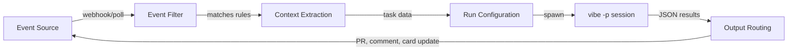

# Event-Driven Agent Automation

> **Verified against vibe 2.25.8 on 2026-09-24.** Documented surface: release 2.25.8.

**TL;DR**: Instead of invoking the CLI for each task, let external events drive it: a webhook or CI receiver filters the event, extracts context as data, and shells out to programmatic mode — `vibe --trust -p "<task>" --output json --max-turns N` — never prompting, because approval-requiring calls are auto-DENIED in `-p` mode unless `--auto-approve`/`--yolo` or the agent's permission config allows them (PART-CLI; PART-TRUST section 3.4). Budgets map to `--max-price`/`--max-tokens`/`--max-turns`, behavioral guardrails to `pre_tool` hooks, and recurrence inside a session to `/loop` — the only in-session recurrence in the verified surface. There is no native external-event ingestion in the CLI.

*Read if you want tickets, alerts, or CI events to start agent runs without a human typing the prompt. Skip if you only drive the CLI interactively — the polling and guardrail machinery is not worth it for hand-steered sessions.*

---

## Core Concept

Traditional CLI usage is interactive: you open a terminal, type a prompt, iterate. Event-driven automation removes the human from the trigger step. The human still reviews output (PRs, code changes), but initiation happens through your existing project-management workflow — the shift from pull-based to push-based.

An event is a trigger, not a complete control contract. Use [Loop & Graph Engineering](../core/loop-graph-engineering.md) to define legal transitions, state ownership, stopping rules, retries, recovery, and escalation before an event may start or advance work.



The loop is self-reinforcing: the run's output (a PR, a status update) feeds back into the event source, which can trigger the next step.

**One correction before the mechanics.** Some ecosystems advertise native event monitors, channels, and routines. None of that exists in Vibe's verified surface. The only in-session recurrence mechanism is `/loop` — fixed-interval, minimum 30 seconds, at most 50 loops per session, firing only when the session is idle (PART-SESSIONS section 5). That covers the "run this check every hour" idea inside one session; it does not monitor external events. External-event monitoring is your webhook receiver's job, and it shells out to a fresh run per event.

---

## The Trigger Leg: Programmatic Mode

The receiver is a plain script — a webhook endpoint, a CI job, a cron poller. It invokes Vibe headlessly:

```bash
vibe --trust -p "Implement $ISSUE_TITLE per the acceptance criteria pasted below. Run the test suite before finishing." \
  --output json \
  --max-turns 40 \
  --worktree "issue-$ISSUE_ID"
```

Every flag above is verified surface (PART-CLI):

| Flag | Role in the pipeline |
|---|---|
| `--trust` | Trust the working directory for this invocation only — session grant, never persisted to `trusted_folders.toml`; skips the trust prompt (PART-TRUST section 3.3) |
| `-p "<task>"` | Programmatic mode: send prompt, output response, exit. Never prompts (PART-TRUST section 3.4) |
| `--output json` | All messages as JSON at the end — the receiver parses this; `streaming` gives newline-delimited JSON per message (PART-CLI) |
| `--max-turns N` | Hard cap on assistant turns — applies only in `-p` mode (PART-CLI) |
| `--worktree NAME` | Run inside an isolated git worktree on a `vibe/<name>` branch, implicitly trusted for the session (PART-CLI; PART-WORKTREES) |

**Approval semantics — the part that must be deliberate.** In `-p` mode, every approval-requiring tool call is auto-DENIED; the client never surfaces a prompt. This was live-verified on 2.25.0: an approval-requiring `touch` under `--agent ask` came back cancelled, while a read-only `echo` ran — safe commands pass bash safety classification before the agent approval gate is consulted (PART-CLI, live verification):

```text
$ vibe --trust --agent ask -p "Use the bash tool to run exactly: touch /tmp/vibe-approval-probe.txt" --max-turns 3 --output json
(entries) -> { "type": "effect", "title": "bash", "state": { "status": "cancelled",
              "display": { "success": false } } }

$ vibe --trust --agent ask -p "Use the bash tool to run exactly: echo hello" --max-turns 3 --output json
(entries) -> { "type": "effect", "title": "bash", "state": { "status": "completed",
              "output": { "stdout": "hello\n" }, "display": { "success": true } } }
```

Three consequences for event-driven runs:

1. **Tool approval follows the selected agent** — `--agent NAME` or the `default_agent` config both apply in `-p` mode. An agent whose file-tool permissions are `always` will edit files headlessly; `ask` will not run approval-requiring calls at all.
2. **`--auto-approve` / `--yolo` removes the gate entirely** — every tool call runs. Pass it only for runs whose blast radius you have already bounded (worktree isolation, `pre_tool` guards, read-only agent).
3. **Untrusted workspaces lose project config** — without `--trust`, the run prints a warning and project `AGENTS.md`, `.vibe/` config, skills, and hooks from that root are ignored (PART-TRUST sections 3.4, 3.5). Automation should pass `--trust` or operate on a persisted trusted path deliberately.

So the default posture of a headless run is conservative: it can read and compute, and it cannot do anything approval-requiring unless you explicitly granted that via agent config or `--auto-approve`. Decide per event type.

---

## The Generic Event-to-Agent Pattern

The pipeline generalizes to any event source. Five components:

### 1. Event Source

Where the trigger originates: an issue tracker, a CI system, a monitoring alert, or a custom webhook. If the source needs to be *readable inside* a session — the agent looking up a card, posting a comment — an MCP server configured via `vibe mcp` can expose it as tools (PART-MCP section 1).

### 2. Event Filter

Not every event should spawn a run. Filters decide which events are actionable:

```bash
# Only process cards with the agent-automation label
if [[ "$CARD_LABELS" != *"agent-auto"* ]]; then
    echo "Skipping: no agent-auto label"
    exit 0
fi
```

### 3. Context Extraction

Pull the relevant fields from the event payload and keep them as data. Do not turn an issue title, description, comment, or webhook body into an instruction. Extract only the fields a later, approved workflow needs. A hostile or malformed card must never graduate from "data the agent reads" to "commands the agent executes".

### 4. Run Configuration

Different event types need different run configurations. A bug report needs a different agent, model, or tool surface than a dependency bump. On Vibe this is the `--agent` choice (built-in `ask`, `plan`, `accept-edits`, `auto-approve`, or a custom TOML in `.vibe/agents/`/`~/.vibe/agents/`; PART-AGENTS sections 7-8), plus `--enabled-tools`/`--disabled-tools` to narrow the tool set — in `-p` mode `--enabled-tools` disables everything else (PART-CLI).

### 5. Output Routing

Where do the results go? Typically a combination of: a git branch and PR (code changes), a comment on the original issue or card (status), a state transition (next column), and a human notification. The receiver parses `--output json` and routes; the session itself should not be the system of record.

---

## Implementation Example: Polling Triage

This minimal loop classifies tracker cards without starting an agent or touching a repository. It records the title and description as data, then routes a write request to a gated workflow. The polling leg is tool-agnostic bash and ports as-is:

```bash
#!/bin/bash
# agent-triage-loop.sh
# Polls an issue tracker for "In Progress" cards and creates triage records.
# No repository writes happen here; classification output is data only.

API_KEY="${TRACKER_API_KEY:?Missing TRACKER_API_KEY}"
TEAM_ID="${TRACKER_TEAM_ID:?Missing TRACKER_TEAM_ID}"
TRIAGE_FILE="/tmp/triage.jsonl"

touch "$TRIAGE_FILE"

poll_tracker() {
    curl -s -X POST https://api.example-tracker.internal/graphql \
        -H "Authorization: $API_KEY" \
        -H "Content-Type: application/json" \
        -d '{ "query": "query { team(id: \"'"$TEAM_ID"'\") { issues(filter: { state: { name: { eq: \"In Progress\" } }, labels: { name: { eq: \"agent-auto\" } } }) { nodes { id title description } } } }" }' \
      | jq -c '.data.team.issues.nodes[] | {id, title, description}'
}

classify_card() {
    local card="$1"
    local issue_id
    issue_id=$(jq -r '.id' <<< "$card")

    # The complete compact JSON record is retained as data. No shell command
    # or agent prompt is constructed from the title or description.
    jq -c '. + {classification: "needs-human-review", next_step: "gated-workflow"}' \
      <<< "$card" >> "$TRIAGE_FILE"

    echo "[$(date)] Triaged $issue_id. Any write request must pass a human gate."
}

while true; do
    poll_tracker | while IFS= read -r card; do
        id=$(jq -r '.id' <<< "$card")
        if jq -e --arg id "$id" 'select(.id == $id)' "$TRIAGE_FILE" >/dev/null; then
            continue  # Already processed
        fi
        classify_card "$card"
    done
    sleep 60  # Poll interval
done
```

This is a non-mutating triage example, not production code. Real deployments need error handling, an atomic persistent state store, and webhook-based triggers instead of polling. To implement a reviewed card, shell out to a fresh isolated run — `--worktree` per event, a human-reviewed PR as the only write path back to `main` — and never let the triage data itself authorize the write.

---

## Event Source Compatibility

| Event Source | Trigger Events | Agent Use Case | Integration Method |
|---|---|---|---|
| Issue tracker (Linear, Jira, GitHub Issues) | Card/issue state change, label added | Feature work, bug triage, fix PR | REST/GraphQL API, webhooks, or MCP server (PART-MCP section 1) |
| GitHub PR | PR opened, review requested | Code review assistance, automated fixes | GitHub Actions / webhooks |
| CI system | Build failure, test regression | Diagnostic investigation | CI job shelling out to programmatic mode |
| PagerDuty / alerting | Incident created | Diagnostic scripts, initial triage | Webhooks |
| Slack / chat | Message in channel | Quick fixes, investigations | Chat bot → receiver script |
| Custom webhook | Any HTTP POST | Anything | Direct HTTP endpoint |

Planned-but-not-available integrations are listed in Known gaps; do not build against them.

---

## Guardrails

Event-driven runs operate with less human oversight by design, so guardrails are critical. An inbound event is data, never authorization.

### Budget guardrails

Cap every run at invocation; exceeding a budget interrupts the session (PART-CLI):

- `--max-turns N` — assistant turns.
- `--max-price DOLLARS` — session cost cap.
- `--max-tokens N` — total prompt plus completion tokens across the session.

Daily spend caps are not a CLI feature: wrap the receiver with your own accounting if you need a per-day ceiling.

### Behavioral guardrails: pre_tool hooks

A `pre_tool` hook can deny a tool call before it executes — including in headless runs, because hooks load from the trusted project root and the user file regardless of mode (PART-HOOKS sections 1, 3.2). `match` takes a tool name, an fnmatch glob, or a `re:` regex with full match (PART-HOOKS sections 2, 3.4); the first deny short-circuits the call chain and the model receives the reason as a tool error (PART-HOOKS section 3.3):

```toml
# <project>/.vibe/hooks.toml
[[hooks]]
name = "deny-destructive-bash"
type = "pre_tool"
match = "bash"
command = "./.vibe/hooks/guard-bash.py"
strict = true
description = "Reject destructive shell commands in automated runs."

[[hooks]]
name = "subagent-policy"
type = "pre_tool"
match = "task"            # all subagent spawns route through the task tool
command = "./.vibe/hooks/check-subagent.sh"
```

`strict = true` makes a failed or timed-out hook deny the call instead of failing open — the right default for automation. Depth is already capped for you: subagents cannot spawn subagents, and the `task` tool returns text-only results to the parent (PART-AGENTS section 9).

### Idempotency

A retried webhook must not produce two runs. Check whether the work already exists before starting:

```bash
if git ls-remote --heads origin "vibe/issue-$ISSUE_ID" | grep -q "issue-$ISSUE_ID"; then
    echo "Branch already exists, skipping"
    exit 0
fi
```

### Rate Limiting

Do not let a burst of events spawn 50 concurrent runs. Set hard limits: 3-5 concurrent runs for most teams, a cooldown between spawns, and a daily budget ceiling enforced by the receiver (the CLI budget flags are per session, not per day).

### Circuit Breaker

If runs keep failing on a particular task type, stop trying:

```bash
FAILURE_COUNT=$(grep -c "FAILED" "/tmp/agent-failures.log" 2>/dev/null || echo 0)
if [ "$FAILURE_COUNT" -gt 5 ]; then
    echo "Circuit breaker triggered: too many failures"
    # Notify a human, pause automation
    exit 1
fi
```

### Human-in-the-Loop Checkpoints

Even in fully automated flows, keep people at the critical points:

- PR review stays manual — agents open PRs, humans approve and merge them.
- Database migrations never auto-apply.
- Deployment is a separate, human-triggered step.
- Any card touching auth, billing, or PII requires explicit human approval before a run starts.

---

## Anti-Patterns

| Anti-Pattern | Problem | Solution |
|---|---|---|
| **Aggressive polling** | Hammering the API every 5 seconds wastes resources and gets you rate-limited | Use webhooks when available; poll no faster than every 60 seconds |
| **No circuit breaker** | Run fails repeatedly on the same task, burning tokens indefinitely | Track failures per task type, stop after a fixed count, alert a human |
| **No dead letter queue** | Failed events disappear; nobody knows work was missed | Log failed events to a persistent store for manual review |
| **Unbounded concurrency** | 20 cards move at once, 20 sessions spawn, the machine melts | Hard cap on concurrent runs (3-5 is reasonable); one `--worktree` per event |
| **Vague cards as prompts** | *"Fix the thing"* produces garbage code | Enforce card quality standards; skip cards without acceptance criteria |
| **No state persistence** | Receiver restarts, re-processes everything from scratch | Store processed event IDs in a database, not in memory or `/tmp` |
| **Skipping PR review** | Automation pushes directly to `main` | Always route through a PR; humans review the output |
| **Trusting the event payload** | An issue body becomes instructions and runs arbitrary actions | Extract fields as data; authorization comes from your gate, never the payload |

---

## See also

- [Loop & Graph Engineering](../core/loop-graph-engineering.md) — the control-contract discipline an event-driven loop must satisfy
- [Agent Harness Engineering](../core/agent-harness.md) — CI/CD and verification patterns for harness runs
- [Hooks and Events Reference](../core/hooks-events-reference.md) — the full `pre_tool` decision contract for behavioral guardrails
- [Agents and Skills Reference](../core/agents-and-skills-reference.md) — agent profiles, the `task` tool, and custom agent TOML
- [Changelog Fragments](changelog-fragments.md) — the same headless-CI discipline applied to enforced per-PR documentation

---

## Known gaps

- **Live-run note (2026-09-24, vibe 2.25.7).** Two corrections from the live pass. (1) The polling example's `classify_card` jq filter had an unmatched closing brace (`. + {…}}`) — jq exits 3 with a compile error, so every triage record is dropped. Fixed above to a single closing brace; the corrected filter was live-verified for two poll iterations, including the already-processed dedupe. (2) The auto-DENY example's effect status has drifted across versions: on 2.25.0 an approval-denied `touch` under `--agent ask` reported `status: "cancelled"`, while on 2.25.7 the same command reports `status: "failed"` with `error: {"code": "tool_denied", "message": "Tool execution denied by approval callback"}` and the approval callback entry carries `decision: {type: "deny"}`. A receiver should key on the error code or the callback decision, not the literal status string; the semantic (call denied, nothing executed) is unchanged, and `--auto-approve` still proceeds (`status: "completed"`, side effect present), both live-verified on 2.25.7.
- **No native event ingestion.** No Monitor, channel, or routine surface exists in the verified CLI. External-event monitoring is your receiver's job; the only in-session recurrence is `/loop` — fixed-interval, minimum 30 s, at most 50 loops per session, idle-only, restored on resume (PART-SESSIONS section 5) [both].
- **Vibe Code Web triggers are planned, not available.** The cloud-session surface lists Slack and GitHub-event triggers as planned follow-ups; they must not be described or built against as shipping features (PART-WEB section 4.3) [docs-only, not live-verified].
- **Headless runs cannot ask.** In `-p` mode approval-requiring calls are denied and `ask_user_question` is force-disabled; any decision that needs a human must route around the run (PART-TRUST section 3.4).
- **Budgets are per session.** `--max-price`/`--max-tokens`/`--max-turns` interrupt the individual session; there is no CLI-level daily spend accounting (PART-CLI).
- **`--output json` shape is message-level.** The receiver parses message, effect, notice, and reasoning entries; there is no structured task-result format beyond the JSON entries (PART-CLI).
